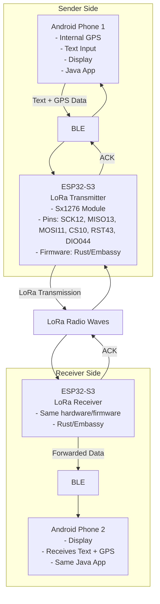
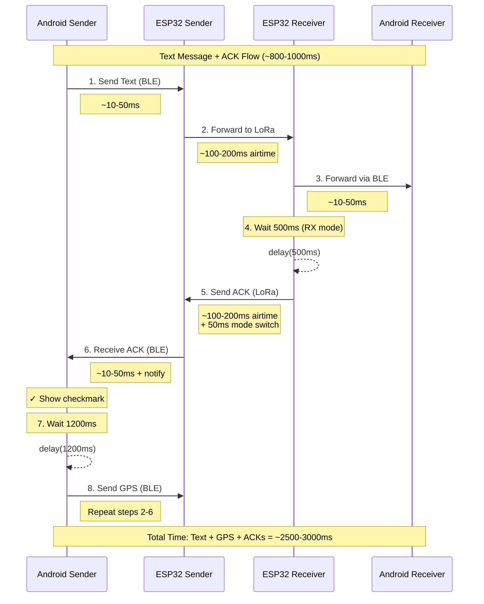

# LoRa Android RS

A long-range communication system for sending text messages (up to 50 characters) and GPS coordinates via 433 MHz LoRa using ESP32-S3 and Android devices.

## Features

- 📱 **Android App**: Java-based app with GPS integration and BLE communication
- 📡 **Long Range**: 5-10 km typical range (up to 15+ km in ideal conditions)
- 🔋 **Power Optimized**: 40-50% power savings (70-100 hours on 2500 mAh battery)
- 📦 **Message Buffering**: Buffers up to 10 messages when phone is disconnected
- ✅ **Reliable**: ACK mechanism confirms message delivery
- 🌍 **GPS Precision**: ±1 meter accuracy (GPS sent only when available)
- 🚀 **Fast**: ~1-2 second end-to-end latency
- 📉 **Bandwidth Efficient**: 6-bit character packing (40% smaller than UTF-8)

## Architecture



## Project Structure

```
android-lora-ble-bridge/
├── esp32/                # ESP32 firmware (C++/Arduino) - Transceiver with BLE
│   ├── src/
│   │   ├── main.cpp          # Main firmware with BLE and LoRa
│   │   ├── BLEManager.cpp    # BLE GATT server implementation
│   │   ├── Protocol.cpp      # Binary protocol implementation
│   │   └── SleepManager.cpp  # Power management and deep sleep
│   ├── include/
│   │   ├── BLEManager.h
│   │   ├── LEDManager.h
│   │   ├── LoRaManager.h
│   │   ├── Protocol.h
│   │   ├── SleepManager.h
│   │   └── lora_config.h
│   ├── platformio.ini        # PlatformIO configuration
│   └── CHANGELOG.md
├── esp32s3/              # ESP32-S3 firmware (Rust/Embassy) - Alternative implementation
│   ├── src/
│   │   ├── bin/
│   │   │   └── main.rs       # Main entry point and task spawning
│   │   ├── ble.rs            # BLE GATT server (advertises as "ESP32S3-LoRa")
│   │   ├── lora.rs           # LoRa radio driver and message handling
│   │   ├── protocol.rs       # Binary protocol implementation
│   │   └── lib.rs            # Library root
│   ├── Cargo.toml            # Dependencies and build config
│   ├── build.rs              # Build script
│   └── rust-toolchain.toml   # Rust toolchain specification
├── esp32s3-debugger/     # ESP32-S3 LoRa receiver with display (C++/Arduino)
│   ├── src/
│   │   ├── main.cpp          # Receiver firmware with TFT display
│   │   └── Protocol.cpp      # Protocol implementation
│   ├── include/
│   │   ├── DisplayManager.h  # TFT display management
│   │   ├── LoRaManager.h
│   │   ├── Protocol.h
│   │   └── lora_config.h
│   ├── platformio.ini        # PlatformIO configuration
│   └── CHANGELOG.md
├── android/              # Android application (Java)
│   ├── app/src/main/
│   │   ├── java/com/lora/android/
│   │   │   ├── MainActivity.java
│   │   │   ├── MessageAdapter.java
│   │   │   ├── MessageViewModel.java
│   │   │   ├── Protocol.java
│   │   │   └── BleService.java
│   │   └── res/
│   │       ├── layout/
│   │       │   ├── activity_main.xml
│   │       │   └── message_item.xml
│   │       └── drawable/
│   │           ├── message_bubble_sent.xml
│   │           └── message_bubble_received.xml
│   └── build.gradle
├── protocol.md           # Protocol specification
├── CHANGELOG.md          # Project changelog
└── README.md            # This file (you are here)
```

## Building & Installation

### Prerequisites

#### ESP32 Firmware
- [Rust](https://rustup.rs/) (stable)
- [espup](https://github.com/esp-rs/espup) - ESP32 Rust toolchain installer
- ESP32-S3 development board
- SX1276 LoRa module

#### Android App
- [Android Studio](https://developer.android.com/studio) or Android SDK
- JDK 8 or higher
- Gradle (included in Android Studio)

### ESP32 Firmware Build

1. **Install ESP32 Rust toolchain:**
   ```bash
   cargo install espup
   espup install
   . ~/export-esp.sh  # Source the environment
   ```

2. **Build firmware:**
   ```bash
   cd esp32s3
   cargo build --release
   ```

3. **Flash to ESP32-S3:**
   ```bash
   # Recommended (uses .cargo/config.toml runner):
   cargo run --release
   
   # Alternative using espflash directly:
   espflash flash target/xtensa-esp32s3-none-elf/release/esp32s3 --monitor --chip esp32s3
   ```

4. **Monitor logs:**
   ```bash
   espflash monitor
   # Logs show: BLE advertising, LoRa TX/RX, message routing
   ```

### Android App Build

#### Using Android Studio
1. Open the `android/` folder in Android Studio
2. Wait for Gradle sync to complete
3. Connect Android device or start emulator
4. Click "Run" or press Shift+F10

#### Using Command Line
```bash
cd android
./gradlew assembleDebug           # Build APK
./gradlew installDebug             # Install to connected device
```

### Running Tests

**ESP32 Firmware:**
```bash
cd esp32s3
cargo check                        # Type checking
cargo clippy                       # Linting
```

**Android App:**
```bash
cd android
./gradlew test                     # Run unit tests (9 tests)
./gradlew connectedAndroidTest     # Run instrumentation tests
```

### Test Coverage
- **ESP32**: Protocol serialization/deserialization, 6-bit packing
- **Android**: 9 comprehensive unit tests covering:
  - TextMessage, GpsMessage, AckMessage serialization
  - 6-bit character packing/unpacking
  - Round-trip encoding/decoding
  - Character validation and support
  - Edge cases and error handling

## Hardware Setup

### ESP32-S3 to SX1276 Wiring

| SX1276 Pin | ESP32-S3 Pin | Function |
|------------|--------------|----------|
| SCK | GPIO12 | SPI Clock |
| MISO | GPIO13 | SPI MISO |
| MOSI | GPIO11 | SPI MOSI |
| NSS/CS | GPIO10 | Chip Select |
| RESET | GPIO43 | Reset |
| DIO0 | GPIO44 | Interrupt |
| 3.3V | 3.3V | Power |
| GND | GND | Ground |

### LoRa Module Configuration

Edit `esp32s3/.cargo/config.toml`:

```toml
[env]
LORA_TX_POWER_DBM = "14"        # Power in dBm (-4 to 20)
LORA_TX_FREQUENCY = "433920000" # Frequency in Hz
```

**Common Frequencies:**
- 433 MHz: 433920000 (worldwide)
- 868 MHz: 868100000 (Europe)
- 915 MHz: 915000000 (Americas, Australia)

**Regional Power Limits:**
- EU (433 MHz): 2 dBm max
- US (433 MHz): 17 dBm max
- US (915 MHz): 30 dBm max
- Australia: 14 dBm (433 MHz) / 30 dBm (915 MHz)

**Antenna:** Use antenna tuned for your chosen frequency (~17 cm for 433 MHz quarter-wave)

## Message Buffering

The ESP32 firmware buffers up to 10 messages when your phone is disconnected:

**When Phone is Connected:**
- Messages delivered instantly

**When Phone is Disconnected:**
- Messages buffered (up to 10)
- ESP32 continues receiving
- Sender gets ACK immediately

**When You Reconnect:**
- All buffered messages delivered instantly
- Oldest messages first (FIFO)

**If Buffer is Full:**
- Messages 11+ are dropped with warning log
- ESP32 continues receiving (doesn't block)

**Adjusting Buffer Size:**

Edit `esp32s3/src/bin/main.rs`:
```rust
// BLE to LoRa channel (for text+GPS bursts)
static BLE_TO_LORA: StaticCell<Channel<CriticalSectionRawMutex, Message, 5>> = StaticCell::new();

// LoRa to BLE channel (for phone disconnection)
static LORA_TO_BLE: StaticCell<Channel<CriticalSectionRawMutex, Message, 10>> = StaticCell::new();
```

Also update function signatures in `esp32s3/src/ble.rs` and `esp32s3/src/lora.rs`.

**Memory Impact:** ~64 bytes per message

## Usage

### Android App

1. **Launch app** on both Android devices
2. **Grant permissions**: Bluetooth, Location (GPS)
3. **Wait for BLE connection**: App automatically scans for "ESP32-LoRa"
4. **Send message**:
   - Type message (max 50 characters, uppercase A-Z, 0-9, punctuation)
   - GPS is optional - app will send text even without GPS
   - Press "Send"
   - App sends text message first, then GPS (if available) 100ms later
5. **Receive message**: Messages appear automatically on receiving device
6. **View GPS location**: Coordinates displayed if GPS message received

### Message Behavior
- **Text message**: Always sent when you press Send
- **GPS message**: Only sent if GPS is enabled and has a fix
- **No GPS?**: App shows "Sent text only (X bytes) - No GPS"
- **With GPS**: App shows "Sent text (X bytes) + GPS (Y bytes)"

### Character Support
- **Supported**: `A-Z 0-9 .,!?-:;'"@#$%&*()[]{}=+/<>_`
- **Auto-converted**: Lowercase → uppercase (e.g., "hello" becomes "HELLO")
- **Not supported**: Emoji, special Unicode, characters outside the 64-char set

## Performance

- **Max text**: 50 characters (42 bytes with 6-bit packing)
- **GPS message**: 10 bytes (fixed size)
- **Range**: 5-10 km typical (up to 15+ km ideal conditions)
- **Latency**: 1-2 seconds end-to-end
- **Battery**: 70-100 hours on 2500 mAh
- **Time on Air**: 
  - Text only: ~350-550ms (empty to 50 chars) at SF10
  - GPS only: ~380ms at SF10
  - Text + GPS: Combined + 100ms delay (~850-930ms)
- **LoRa Config**: SF10, BW125kHz, CR4/5, 433.92 MHz default, 14 dBm
- **Duty Cycle**: ~38-100 messages/hour depending on message type (EU 1% compliance)

See **[protocol.md](protocol.md)** for detailed Time on Air calculations and duty cycle compliance.

## Message Flow & ACK Timing

Understanding the complete message flow and timing is crucial for reliable ACK delivery:

### Complete Message Flow (Android → LoRa → Android)



### Timing Phases Breakdown

```mermaid
gantt
    title Message Flow Timeline (Text + ACK)
    dateFormat X
    axisFormat %L ms

    section Android→ESP32
    BLE Transfer          :a1, 0, 50
    
    section LoRa TX
    Text Transmission     :a2, 50, 400
    
    section Receiver
    Process & Forward     :a3, 450, 100
    ACK Delay (500ms)     :a4, 550, 500
    
    section LoRa RX
    ACK Transmission      :a5, 1050, 200
    Mode Switch Settle    :a6, 1250, 50
    
    section ESP32→Android
    BLE Notify            :a7, 1300, 50
    
    section Result
    Show Checkmark        :crit, a8, 1350, 50
```



### Critical Timing Parameters

**1. ACK Delay on Receiver (500ms)**
```cpp
// esp32s3-debugger/src/main.cpp
delay(500);  // Wait for sender to return to RX mode
```
- **Purpose**: Ensures ESP32 sender has switched from TX to RX mode
- **Why 500ms**: 
  - LoRa `endPacket()` completes transmission
  - Radio mode switch (TX → RX) takes ~10-50ms
  - ESP32 calls `startReceiveMode()` + 50ms settle time
  - 500ms provides safe buffer for all timing variations

**2. RX Mode Settle Time (50ms)**
```cpp
// esp32/src/main.cpp
loraManager.startReceiveMode();
delay(50);  // Ensure radio is fully in RX mode
```
- **Purpose**: Radio hardware needs time to stabilize in receive mode
- **Why 50ms**: SX1276 mode transitions require 10-30ms, 50ms ensures stability

**3. Text-to-GPS Delay (1200ms)**
```java
// android/app/src/main/java/com/lora/android/MessageViewModel.java
new Handler(Looper.getMainLooper()).postDelayed(() -> {
    // Send GPS message
}, 1200);  // Increased from 100ms to 1200ms
```
- **Purpose**: Allow first ACK to complete before sending second message
- **Why 1200ms**: Complete round-trip timing:
  - Text sent: 0ms
  - ESP32 receives via BLE: ~10-50ms
  - LoRa TX (text): ~100-200ms
  - Receiver gets text: ~200ms
  - Receiver waits: +500ms = ~700ms
  - LoRa TX (ACK): ~100-200ms = ~800-900ms
  - ESP32 receives ACK: ~900ms
  - Android gets ACK via BLE: ~950ms
  - **1200ms buffer ensures ACK fully processed**

### Timing Breakdown by Phase

| Phase | Time | Description |
|-------|------|-------------|
| **BLE Transfer** | 10-50ms | Android ↔ ESP32 via Bluetooth LE |
| **LoRa Airtime (10 bytes)** | ~380ms | GPS or ACK packet at SF10, BW125 |
| **LoRa Airtime (Text)** | 350-550ms | Text (varies by length) at SF10 |
| **Mode Switch (TX→RX)** | 10-50ms | SX1276 radio mode transition |
| **RX Settle** | 50ms | Additional settle time in code |
| **ACK Wait** | 500ms | Deliberate delay before ACK sent |
| **Text→GPS Delay** | 1200ms | Delay between messages |

### Why These Timings Matter

**Problem Without Proper Timing:**
1. Android sends text and GPS too close together (100ms apart)
2. ESP32 transmits text via LoRa
3. ESP32 switches to RX mode but not fully ready
4. Receiver immediately sends ACK
5. **ACK arrives before ESP32 is listening → Lost ACK ❌**
6. GPS message interferes with ACK reception

**Solution With Proper Timing:**
1. Android sends text, waits 1200ms before GPS
2. ESP32 transmits text, switches to RX mode + 50ms settle
3. Receiver waits 500ms before sending ACK
4. ESP32 is fully ready and receives ACK ✓
5. Android displays checkmark
6. After 1200ms total, GPS is sent (ACK fully processed)
7. Process repeats for GPS message

### Adjusting Timings

If you need to modify timing for different hardware or conditions:

**Increase ACK delay** (better reliability, slower):
```cpp
// esp32s3-debugger/src/main.cpp
delay(1000);  // Increase from 500ms
```

**Increase message spacing** (avoid interference):
```java
// MessageViewModel.java
}, 2000);  // Increase from 1200ms
```

**Decrease for faster operation** (requires testing):
- Minimum ACK delay: ~200ms (theoretical, not recommended)
- Minimum message spacing: ~800ms (if ACKs not critical)

**Formula for safe message spacing:**
```
Spacing = LoRa_TX_Time + RX_Mode_Switch + ACK_Delay + LoRa_ACK_Time + Processing_Buffer
        ≈ 400ms + 100ms + 500ms + 380ms + 200ms
        ≈ 1580ms (round up to 1200ms with optimizations)
```

### Debugging Timing Issues

**Symptoms of timing problems:**
- ✗ First message never gets ACK
- ✓ Second message always gets ACK
- ✗ ACKs received out of order
- ✗ Messages sent but receiver stays in TX mode

**Log messages to watch:**
```bash
# ESP32 Sender
"LoRa TX successful"
"Packet sent successfully!"
# Then should see within ~1 second:
"LoRa RX: received 2 bytes"  # ACK received!

# ESP32 Receiver
"LoRa RX: received X bytes"
"Sending ACK for seq: N"
"ACK sent successfully"
```

**If ACKs are missing:**
1. Increase ACK_DELAY in debugger (500ms → 1000ms)
2. Increase RX settle time in sender (50ms → 100ms)
3. Increase message spacing in Android (1200ms → 2000ms)
4. Check serial logs for mode transition timing

## Troubleshooting

### ESP32 Issues

**BLE not advertising:**
- Check serial monitor for "BLE advertising..." message
- Verify Bluetooth is enabled in ESP32 logs
- Restart ESP32 (power cycle)

**LoRa not transmitting:**
- Check SPI wiring (SCK, MISO, MOSI, CS)
- Verify 3.3V power to LoRa module
- Check antenna connection (433 MHz antenna)
- Monitor serial for "LoRa TX successful" messages

**Radio init failed:**
- Check RESET and DIO0 pin connections
- Verify SX1276 module is 433 MHz capable
- Check power supply (some modules need more current)

### Android Issues

**App can't find ESP32:**
- Grant Bluetooth and Location permissions
- Enable Bluetooth on phone
- Ensure ESP32 is powered and advertising
- Check that device name is "ESP32S3-LoRa" in logs
- Try restarting both phone and ESP32

**No GPS fix:**
- Text messages can still be sent without GPS
- GPS message only sent when location is available
- Check app shows "Sent text only - No GPS" when GPS unavailable
- For GPS-required scenarios:
  - Go outdoors or near window
  - Wait 30-60 seconds for GPS acquisition
  - Check Location permission is granted
  - Enable "High accuracy" in phone location settings

**Messages not received:**
- Check both ESP32 devices are powered
- Verify LoRa range (start close, then test distance)
- Check serial monitor for "LoRa RX: received X bytes"
- Ensure devices are on same frequency (433 MHz)

### Debug Tips

**Protocol Version Compatibility:**
- ⚠️ Protocol v2.0 is **not backward compatible** with v1.0
- All devices must run same protocol version
- v2.0 changes:
  - Message types: TEXT (0x01), GPS (0x02), ACK (0x03)
  - 6-bit character encoding (not UTF-8)
  - GPS sent separately from text

**ESP32 Serial Monitor:**
```bash
espflash monitor
# Look for:
# - "BLE advertising..."
# - "LoRa radio ready for RX/TX"
# - "Message forwarded from BLE to LoRa"
# - "LoRa TX successful"
# - "LoRa RX: received X bytes"
```

**Android Logcat:**
```bash
adb logcat -s LoRaApp
# Or use Android Studio's Logcat viewer
```

## External Resources
- [ESP32-S3 Documentation](https://docs.espressif.com/projects/esp-idf/en/latest/esp32s3/)
- [SX1276 Datasheet](https://www.semtech.com/products/wireless-rf/lora-core/sx1276)
- [LoRa Calculator](https://www.loratools.nl/#/airtime) - Time on Air calculator
- [ESP-RS Book](https://esp-rs.github.io/book/) - Rust on ESP32

## License

[Add your license here]

## Contributing

[Add contribution guidelines here]

## Acknowledgments

Built with:
- [Embassy](https://embassy.dev/) - Async Rust framework for embedded systems
- [esp-hal](https://github.com/esp-rs/esp-hal) - ESP32 Hardware Abstraction Layer (v1.0.0-rc.1)
- [esp-rtos](https://crates.io/crates/esp-rtos) - ESP32 RTOS integration with Embassy
- [trouble-host](https://github.com/embassy-rs/trouble) - BLE Host stack (v0.5.0)
- [lora-phy](https://github.com/lora-rs/lora-rs) - LoRa PHY driver (v3.0.1)
- [esp-radio](https://crates.io/crates/esp-radio) - Wi-Fi/BLE radio controller

---

**Ready for long-range adventures!** 📡🌍