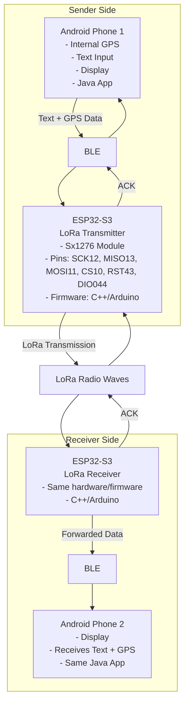
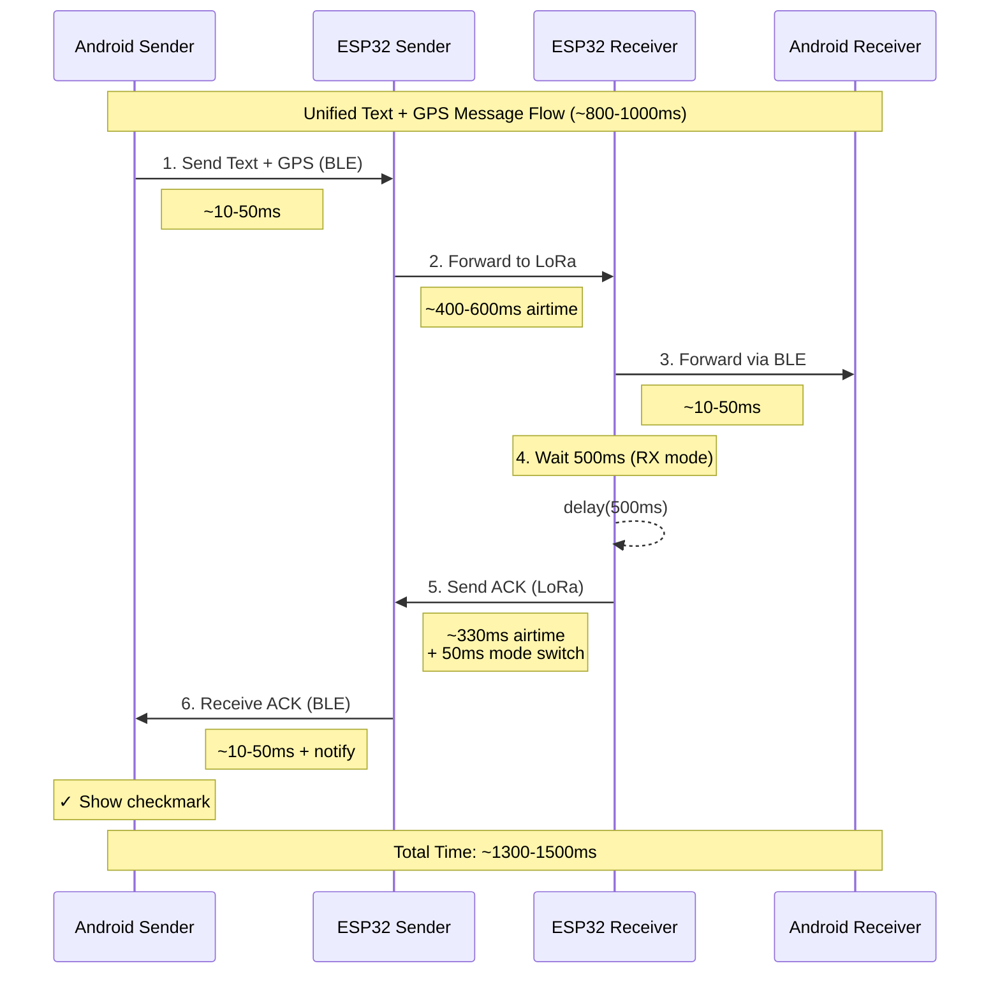

# Android LoRa BLE Bridge

A long-range communication system for sending text messages (up to 50 characters) and GPS coordinates via 433 MHz LoRa using ESP32-S3 (C++/Arduino firmware) and Android devices.

## Features

- 📱 **Android App**: Modern Java app with ViewBinding, GPS integration, and BLE communication
- 🔔 **Background Service**: Receives messages even when app is minimized (Android 8.0+)
- 📡 **Long Range**: 5-10 km typical range (up to 15+ km in ideal conditions)
- 🔋 **Power Optimized**: 40-50% power savings (70-100 hours on 2500 mAh battery)
- 📦 **Message Buffering**: Buffers up to 10 messages when phone is disconnected
- ✅ **Reliable**: ACK mechanism confirms message delivery with automatic retry
- 🌍 **GPS Precision**: ±1 meter accuracy (GPS sent only when available)
- 🚀 **Fast**: ~1-2 second end-to-end latency
- 📉 **Bandwidth Efficient**: 6-bit character packing (40% smaller than UTF-8)
- 🔧 **Improved Stability**: Extended timeouts and async operations prevent disconnects

## Architecture



## Project Structure

```
android-lora-ble-bridge/
├── android/              # Android application (Java)
├── esp32/                # ESP32 firmware (C++/Arduino) - Transceiver with BLE
├── esp32s3-debugger/     # ESP32-S3 LoRa receiver with display (C++/Arduino)
├── protocol.md           # Protocol specification
├── CHANGELOG.md          # Project changelog
└── README.md             # This file (you are here)
```

## Building & Installation

### Prerequisites

#### Android App
- [Android Studio](https://developer.android.com/studio) or Android SDK
- JDK 17 or higher (for ViewBinding support)
- Gradle (included in Android Studio)

### Android App Build

#### Using Android Studio
1. Open the `android/` folder in Android Studio
2. Wait for Gradle sync to complete
3. Connect Android device or start emulator
4. Click "Run" or press Shift+F10

#### Using Command Line
```bash
cd android
./gradlew assembleDebug           # Build APK
./gradlew installDebug             # Install to connected device
```

### Running Tests

**Android App:**
```bash
cd android
./gradlew test                     # Run unit tests (9 tests)
./gradlew connectedAndroidTest     # Run instrumentation tests
```

### Test Coverage
- **ESP32**: Protocol serialization/deserialization, 6-bit packing
- **Android**: 9 comprehensive unit tests covering:
  - TextMessage, GpsMessage, AckMessage serialization
  - 6-bit character packing/unpacking
  - Round-trip encoding/decoding
  - Character validation and support
  - Edge cases and error handling

## Hardware Setup

### ESP32-S3 to SX1278 Wiring

| SX1278 Pin | ESP32-S3 Pin | Function |
|------------|--------------|----------|
| SCK | GPIO12 | SPI Clock |
| MISO | GPIO13 | SPI MISO |
| MOSI | GPIO11 | SPI MOSI |
| NSS/CS | GPIO10 | Chip Select |
| RESET | GPIO43 | Reset |
| DIO0 | GPIO44 | Interrupt |
| 3.3V | 3.3V | Power |
| GND | GND | Ground |

### LoRa Module Configuration

**Common Frequencies:**
- 433 MHz: 433920000 (worldwide)
- 868 MHz: 868100000 (Europe)
- 915 MHz: 915000000 (Americas, Australia)

**Regional Power Limits:**
- EU (433 MHz): 2 dBm max
- US (433 MHz): 17 dBm max
- US (915 MHz): 30 dBm max
- Australia: 14 dBm (433 MHz) / 30 dBm (915 MHz)

**Antenna:** Use antenna tuned for your chosen frequency (~17 cm for 433 MHz quarter-wave)

## Message Buffering

The ESP32 firmware buffers up to 10 messages when your phone is disconnected:

**When Phone is Connected:**
- Messages delivered instantly

**When Phone is Disconnected:**
- Messages buffered (up to 10)
- ESP32 continues receiving
- Sender gets ACK immediately

**When You Reconnect:**
- All buffered messages delivered instantly
- Oldest messages first (FIFO)

**If Buffer is Full:**
- Messages 11+ are dropped with warning log
- ESP32 continues receiving (doesn't block)

## Usage

### Android App

1. **Launch app** on both Android devices
2. **Grant permissions**: Bluetooth, Location (GPS)
3. **Wait for BLE connection**: App automatically scans for "ESP32-LoRa"
4. **Send message**:
   - Type message (max 50 characters, uppercase A-Z, 0-9, punctuation)
   - GPS is optional - app will send text even without GPS
   - Press "Send"
   - App sends text message first, then GPS (if available) 100ms later
5. **Receive message**: Messages appear automatically on receiving device
6. **View GPS location**: Coordinates displayed if GPS coordinates received

### Message Behavior
- **Text message**: Always sent when you press Send
- **GPS coordinates**: Automatically included if GPS is enabled and location available
- **Single message**: Text and GPS sent together in one unified message
- **No GPS?**: App shows "Sent text only (X bytes) - No GPS"
- **With GPS**: App shows "Sent text (X bytes) + GPS (Y bytes)"

### Character Support
- **Supported**: `A-Z 0-9 .,!?-:;'"@#$%&*()[]{}=+/<>_`
- **Auto-converted**: Lowercase → uppercase (e.g., "hello" becomes "HELLO")
- **Not supported**: Emoji, special Unicode, characters outside the 64-char set

## Performance

- **Max text**: 50 characters (42 bytes with 6-bit packing)
- **GPS data**: 8 bytes when included (fixed size)
- **Range**: 5-10 km typical (up to 15+ km ideal conditions)
- **Latency**: 1-2 seconds end-to-end
- **Battery**: 70-100 hours on 2500 mAh
- **Time on Air**: 
  - Text only: ~350-550ms (empty to 50 chars) at SF10
  - Text + GPS: ~420-600ms (varies by text length)
  - ACK: ~330ms at SF10
- **LoRa Config**: SF10, BW125kHz, CR4/5, 433.92 MHz default, 14 dBm
- **Duty Cycle**: ~38-100 messages/hour depending on message type (EU 1% compliance)

See **[protocol.md](protocol.md)** for detailed Time on Air calculations and duty cycle compliance.

## Message Flow & ACK Timing

Understanding the complete message flow and timing is crucial for reliable ACK delivery:

### Complete Message Flow (Android → LoRa → Android)



### Timing Phases Breakdown

```mermaid
gantt
    title Unified Message Flow Timeline (~1300-1500ms)
    dateFormat X
    axisFormat %L ms

    section Android→ESP32
    BLE Transfer          :a1, 0, 50
    
    section LoRa TX
    Text+GPS Transmission :a2, 50, 550
    
    section Receiver
    Process & Forward     :a3, 600, 100
    ACK Delay (500ms)     :a4, 700, 500
    
    section LoRa RX
    ACK Transmission      :a5, 1200, 200
    Mode Switch Settle    :a6, 1400, 50
    
    section ESP32→Android
    BLE Notify            :a7, 1450, 50
    
    section Result
    Show Checkmark        :crit, a8, 1500, 50
```



### Critical Timing Parameters

**1. ACK Delay on Receiver (500ms)**
```cpp
// esp32s3-debugger/src/main.cpp
delay(500);  // Wait for sender to return to RX mode
```
- **Purpose**: Ensures ESP32 sender has switched from TX to RX mode
- **Why 500ms**: 
  - LoRa `endPacket()` completes transmission
  - Radio mode switch (TX → RX) takes ~10-50ms
  - ESP32 calls `startReceiveMode()` + 50ms settle time
  - 500ms provides safe buffer for all timing variations

**2. RX Mode Settle Time (50ms)**
```cpp
// esp32/src/main.cpp
loraManager.startReceiveMode();
delay(50);  // Ensure radio is fully in RX mode
```
- **Purpose**: Radio hardware needs time to stabilize in receive mode
- **Why 50ms**: SX1278 mode transitions require 10-30ms, 50ms ensures stability

### Timing Breakdown by Phase

| Phase | Time | Description |
|-------|------|-------------|
| **BLE Transfer** | 10-50ms | Android ↔ ESP32 via Bluetooth LE |
| **LoRa Airtime** | 350-600ms | Text+GPS packet at SF10, BW125 (varies by length) |
| **Mode Switch (TX→RX)** | 10-50ms | SX1278 radio mode transition |
| **RX Settle** | 50ms | Additional settle time in code |
| **ACK Wait** | 500ms | Deliberate delay before ACK sent |
| **ACK Airtime** | ~330ms | ACK packet (2 bytes) at SF10 |

### Why These Timings Matter

**Problem Without Proper Timing:**
1. Android sends unified text+GPS message via BLE
2. ESP32 transmits via LoRa
3. ESP32 switches to RX mode but not fully ready
4. Receiver immediately sends ACK
5. **ACK arrives before ESP32 is listening → Lost ACK ❌**

**Solution With Proper Timing:**
1. Android sends unified message, ESP32 transmits via LoRa
2. ESP32 switches to RX mode + 50ms settle
3. Receiver waits 500ms before sending ACK
4. ESP32 is fully ready and receives ACK ✓
5. Android displays checkmark

### Adjusting Timings

If you need to modify timing for different hardware or conditions:

**Increase ACK delay** (better reliability, slower):
```cpp
// esp32s3-debugger/src/main.cpp
delay(1000);  // Increase from 500ms
```

**Decrease for faster operation** (requires testing):
- Minimum ACK delay: ~200ms (theoretical, not recommended)
- Reduced RX settle time: 25ms (if hardware allows)

**Formula for safe ACK timing:**
```
ACK_Delay = LoRa_TX_Time + RX_Mode_Switch + Processing_Buffer
         ≈ 600ms + 100ms + 200ms
         ≈ 900ms (round up to 500ms with optimizations)
```

### Debugging Timing Issues

**Symptoms of timing problems:**
- ✗ Message never gets ACK
- ✓ ACKs received inconsistently
- ✗ Messages sent but receiver stays in TX mode

**Log messages to watch:**
```bash
# ESP32 Sender
"LoRa TX successful"
"Packet sent successfully!"
# Then should see within ~1 second:
"LoRa RX: received 2 bytes"  # ACK received!

# ESP32 Receiver
"LoRa RX: received X bytes"
"Sending ACK for seq: N"
"ACK sent successfully"
```

**If ACKs are missing:**
1. Increase ACK_DELAY in debugger (500ms → 1000ms)
2. Increase RX settle time in sender (50ms → 100ms)
3. Check serial logs for mode transition timing

## Troubleshooting

### ESP32 Issues

**BLE not advertising:**
- Check serial monitor for "BLE advertising..." message
- Verify Bluetooth is enabled in ESP32 logs
- Restart ESP32 (power cycle)

**LoRa not transmitting:**
- Check SPI wiring (SCK, MISO, MOSI, CS)
- Verify 3.3V power to LoRa module
- Check antenna connection (433 MHz antenna)
- Monitor serial for "LoRa TX successful" messages

**Radio init failed:**
- Check RESET and DIO0 pin connections
- Verify SX1278 module is 433 MHz capable
- Check power supply (some modules need more current)

### Android Issues

**App can't find ESP32:**
- Grant Bluetooth and Location permissions
- Enable Bluetooth on phone
- Ensure ESP32 is powered and advertising
- Check that device name is "ESP32S3-LoRa" in logs
- Try restarting both phone and ESP32

**No GPS fix:**
- Text messages can still be sent without GPS
- GPS coordinates only included when location is available
- Check app shows "Sent text only - No GPS" when GPS unavailable
- For GPS-required scenarios:
  - Go outdoors or near window
  - Wait 30-60 seconds for GPS acquisition
  - Check Location permission is granted
  - Enable "High accuracy" in phone location settings

**Messages not received:**
- Check both ESP32 devices are powered
- Verify LoRa range (start close, then test distance)
- Check serial monitor for "LoRa RX: received X bytes"
- Ensure devices are on same frequency (433 MHz)

### Debug Tips

**ESP32 Serial Monitor:**
```bash
espflash monitor
# Look for:
# - "BLE advertising..."
# - "LoRa radio ready for RX/TX"
# - "Message forwarded from BLE to LoRa"
# - "LoRa TX successful"
# - "LoRa RX: received X bytes"
```

**Android Logcat:**
```bash
adb logcat -s LoRaApp
# Or use Android Studio's Logcat viewer
```

## External Resources
- [ESP32-S3 Documentation](https://docs.espressif.com/projects/esp-idf/en/latest/esp32s3/)
- [SX1278 Datasheet](https://www.semtech.com/products/wireless-rf/lora-core/sx1276)
- [LoRa Calculator](https://www.loratools.nl/#/airtime) - Time on Air calculator

## License

[Add your license here]

## Contributing

[Add contribution guidelines here]


## Acknowledgments

Built with:
- [ESP32 Arduino Core](https://github.com/espressif/arduino-esp32) - ESP32 C++/Arduino framework
- [LoRa Library](https://github.com/sandeepmistry/arduino-LoRa) - Arduino LoRa driver
- [NimBLE-Arduino](https://github.com/h2zero/NimBLE-Arduino) - BLE stack for Arduino

---

**Ready for long-range adventures!** 📡🌍
