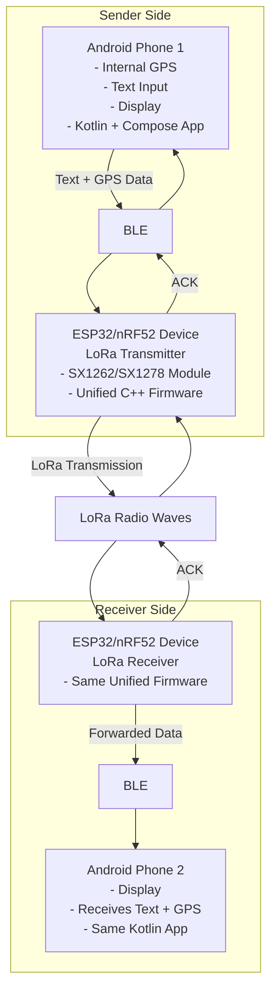
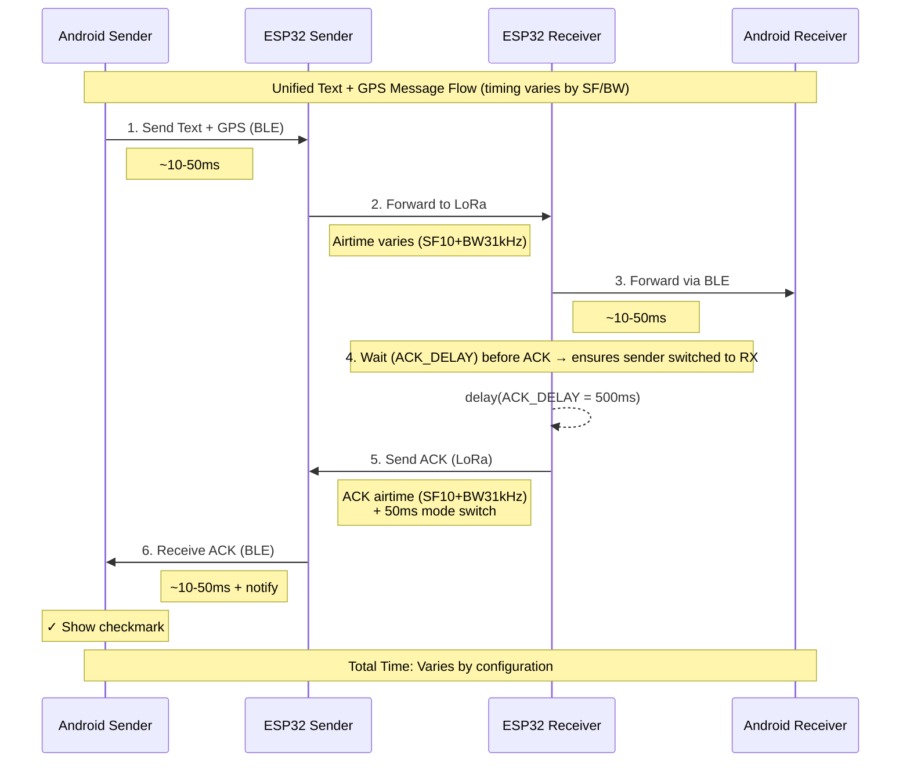

# Android LoRa BLE Bridge

A long-range communication system for sending text messages (up to 50 characters) and GPS coordinates via 433 MHz LoRa using ESP32/ESP32-S3 and Android devices.

## Features

- 📱 **Android App**: Modern Kotlin app with Jetpack Compose, GPS integration, and BLE communication
- 🌐 **Progressive Web App**: Cross-platform PWA with Web Bluetooth support - [Try it now!](https://psytraxx.github.io/android-lora-ble-bridge/)
- 📡 **Long Range**: 5-15 km typical range (SF11 provides excellent range)
- 🔋 **Power Optimized**: Autonomous duty cycle on SX1262 (~52 days on 2500 mAh battery)
- 📦 **Message Buffering**: Buffers up to 10 messages when phone is disconnected
- ✅ **Reliable**: 512-symbol preamble ensures delivery to duty-cycled receivers
- 🌍 **GPS Precision**: ±1 meter accuracy (GPS sent only when available)
- 🚀 **Fast**: ~0.8s airtime with BW250 kHz (6x faster than BW31.25 kHz)
- 📉 **Bandwidth Efficient**: 6-bit character packing (40% smaller than UTF-8)
- 🔧 **Hardware Autonomous**: SX1262 manages duty cycle independently while ESP32 sleeps

## Architecture

### System Overview

The system uses a **unified trait-based architecture** supporting multiple platforms (ESP32 and nRF52) with a single codebase:


```mermaid
graph TD
    A[Android Phone 1<br/>- Internal GPS<br/>- Text Input<br/>- Display<br/>- Kotlin + Compose App] -->|Text + GPS Data| B[BLE]
    B --> C[ESP32/nRF52 Device<br/>LoRa Transmitter<br/>- SX1262/SX1278 Module<br/>- Unified C++ Firmware]
    C -->|LoRa Transmission| D[LoRa Radio Waves]
    D --> E[ESP32/nRF52 Device<br/>LoRa Receiver<br/>- Same Unified Firmware]
    E -->|Forwarded Data| F[BLE]
    F --> G[Android Phone 2<br/>- Display<br/>- Receives Text + GPS<br/>- Same Kotlin App]

    E -->|ACK| D
    D --> C
    C -->|ACK| B
    B --> A

    subgraph "Sender Side"
        A
        B
        C
    end

    subgraph "Receiver Side"
        E
        F
        G
    end
```

### Firmware Architecture

**Trait-Based Multi-Platform Design:**
- **Single unified main.cpp** with `setup()` and `loop()` for all platforms
- **Platform traits** provide compile-time polymorphism
- **Zero runtime overhead** (no virtual functions)
- **Loop-based architecture** - Non-blocking state machines on both platforms
- **Supported platforms:** ESP32, nRF52
- **Supported radios:** SX1262 (autonomous duty cycle), SX1278 (continuous RX)

**Key Components:**
- `unified_main.cpp` - Single entry point with setup()/loop() pattern
- `PlatformTraits.h` - Platform-specific type definitions
- `BLEManager` - BLE integration (NimBLE on ESP32, Arduino BLE on nRF52)
- `LoRaManager` - RadioLib integration with SX1262/SX1278 support
- `MessageQueue` - Simple queue for BLE↔LoRa message passing
- Platform-specific managers with non-blocking operations

## Project Structure

```
android-lora-ble-bridge/
├── android/              # Android application (Kotlin + Jetpack Compose)
├── pwa/                  # Progressive Web App (TypeScript + Lit + Web Bluetooth)
├── firmware/             # Unified C++ firmware (ESP32 & nRF52 support)
│   ├── include/
│   │   ├── common/       # Platform-agnostic code
│   │   ├── esp32/        # ESP32-specific implementations
│   │   └── nrf52/        # nRF52-specific implementations
│   ├── src/
│   │   ├── unified_main.cpp  # Single entry point for all platforms
│   │   ├── Protocol.cpp      # Shared protocol implementation
│   │   ├── esp32/            # ESP32 platform code
│   │   └── nrf52/            # nRF52 platform code
│   ├── platformio.ini    # Build configuration for all platforms
│   └── ARCHITECTURE.md   # Firmware architecture documentation
├── protocol.md           # Protocol specification
├── CHANGELOG.md          # Project changelog
└── README.md             # This file (you are here)
```

## Building & Installation

### Prerequisites

#### Android App
- [Android Studio](https://developer.android.com/studio) or Android SDK
- JDK 11 or higher (for Kotlin + Compose)
- Gradle (included in Android Studio)

#### ESP32/nRF52 Firmware
- [PlatformIO](https://platformio.org/) (recommended) or Arduino IDE
- USB cable for flashing
- Supported boards:
  - ESP32: LilyGo T-Display S3, Heltec WiFi LoRa V3
  - nRF52: Seeed XIAO nRF52840

#### Progressive Web App
- [Node.js](https://nodejs.org/) 18 or higher
- npm (included with Node.js)

### Progressive Web App Build

#### Live Demo
🌐 **Try it now**: [https://psytraxx.github.io/android-lora-ble-bridge/](https://psytraxx.github.io/android-lora-ble-bridge/)

**Browser Requirements:**
- ✅ Chrome 79+ (Desktop: Windows, macOS, Linux)
- ✅ Chrome 56+ (Android)
- ✅ Edge 79+ (Desktop)
- ❌ iOS/Safari (Web Bluetooth not available)
- ❌ Firefox (Web Bluetooth disabled by default)

#### Local Development
```bash
cd pwa
npm install
npm run dev
```

Visit `http://localhost:5173` (Web Bluetooth works on localhost without HTTPS)

#### Production Build
```bash
cd pwa
npm install
npm run build
```

Output will be in `pwa/dist/` directory. See [pwa/DEPLOYMENT.md](pwa/DEPLOYMENT.md) for deployment options.

### ESP32/nRF52 Firmware Build

#### Using PlatformIO (Recommended)

**For ESP32 (LilyGo T-Display S3):**
```bash
cd firmware
~/.platformio/penv/bin/pio run -e lilygo-t-display-s3              # Build
~/.platformio/penv/bin/pio run -e lilygo-t-display-s3 --target upload --target monitor
```

**For ESP32 (Heltec WiFi LoRa V3):**
```bash
cd firmware
~/.platformio/penv/bin/pio run -e heltec-wifi-lora-v3              # Build
~/.platformio/penv/bin/pio run -e heltec-wifi-lora-v3 --target upload --target monitor
```

**For nRF52 (Seeed XIAO):**
```bash
cd firmware
~/.platformio/penv/bin/pio run -e xiao_nrf52840                    # Build
~/.platformio/penv/bin/pio run -e xiao_nrf52840 --target upload --target monitor
```

**Configuration:**
- LoRa settings configured in `firmware/platformio.ini`
- Default: 433.92 MHz, SF9, BW250 kHz, CR4/5
- Device name auto-generated from chip ID
- See `firmware/ARCHITECTURE.md` for platform-specific details

### Android App Build

#### Using Android Studio
1. Open the `android/` folder in Android Studio
2. Wait for Gradle sync to complete
3. Connect Android device or start emulator
4. Click "Run" or press Shift+F10

#### Using Command Line
```bash
cd android
./gradlew assembleDebug           # Build APK
./gradlew installDebug             # Install to connected device
```

### Running Tests

**Android App:**
```bash
cd android
./gradlew test                     # Run unit tests (74 tests)
./gradlew connectedAndroidTest     # Run instrumentation tests
```

### Test Coverage
- **ESP32 (C++)**: Protocol serialization/deserialization, 6-bit packing
- **Android**: 74 comprehensive unit tests covering:
  - Protocol: TextMessage/AckMessage serialization, 6-bit packing/unpacking
  - Domain: Location data, chat messages, round-trip encoding
  - Repository: Message handling, character validation
  - Edge cases and error handling

## Hardware Setup

### Supported Hardware

**ESP32 Boards:**
- **LilyGo T-Display S3** - Built-in display, SX1278 support
- **Heltec WiFi LoRa V3** - SX1262 with autonomous duty cycle

**nRF52 Boards:**
- **Seeed XIAO nRF52840** - Compact form factor, SX1262 support

**LoRa Radios:**
- **SX1278** - Continuous RX mode, lower power
- **SX1262** - Autonomous duty cycle, ultra-low power (~1.5-2mA avg)

### Pin Configurations

**LilyGo T-Display S3 (SX1278):**
| SX1278 Pin | ESP32-S3 Pin | Function |
|------------|--------------|----------|
| SCK | GPIO12 | SPI Clock |
| MISO | GPIO13 | SPI MISO |
| MOSI | GPIO11 | SPI MOSI |
| NSS/CS | GPIO10 | Chip Select |
| RESET | GPIO43 | Reset |
| DIO0 | GPIO3 | Interrupt |
| 3.3V | 3.3V | Power |
| GND | GND | Ground |

**Heltec WiFi LoRa V3 (SX1262):**
| SX1262 Pin | ESP32-S3 Pin | Function |
|------------|--------------|----------|
| SCK | GPIO9 | SPI Clock |
| MISO | GPIO11 | SPI MISO |
| MOSI | GPIO10 | SPI MOSI |
| NSS/CS | GPIO8 | Chip Select |
| RESET | GPIO12 | Reset |
| DIO1 | GPIO14 | Interrupt |
| BUSY | GPIO13 | Busy signal |
| 3.3V | 3.3V | Power |
| GND | GND | Ground |

### LoRa Module Configuration

**Current Configuration (as of Nov 2025):**
- **Frequency**: 433.92 MHz (worldwide ISM band)
- **Bandwidth**: 250 kHz (fast airtime, good range)
- **Spreading Factor**: 9 (balanced range/speed)
- **Coding Rate**: 4/5 (error correction)
- **TX Power**: 20 dBm (100 mW)
- **Preamble**: 8 symbols (default RadioLib)

**Regional Power Limits:**
- EU (433 MHz): 2 dBm max (current config exceeds, adjust for EU compliance)
- US (433 MHz): 17 dBm max ✓
- US (915 MHz): 30 dBm max
- Australia: 14 dBm (433 MHz) ✓ / 30 dBm (915 MHz)

**Antenna:** Use antenna tuned for 433 MHz (~17 cm for quarter-wave)

**Note:** Current TX power (20 dBm) complies with US/AU regulations but exceeds EU limit. For EU operation, reduce to 2 dBm in `platformio.ini`.

## Message Buffering

The firmware (ESP32/nRF52) buffers up to 10 messages when your phone is disconnected:

**When Phone is Connected:**
- Messages delivered instantly

**When Phone is Disconnected:**
- Messages buffered (up to 10)
- Device continues receiving via LoRa
- Sender gets ACK immediately

**When You Reconnect:**
- All buffered messages delivered instantly
- Oldest messages first (FIFO)

**If Buffer is Full:**
- Messages 11+ are dropped with warning log
- Device continues receiving (doesn't block)

## Usage

### Android App

1. **Launch app** on both Android devices
2. **Grant permissions**: Bluetooth, Location (GPS)
3. **Wait for BLE connection**: App automatically scans for device (e.g., "ESP32S3-LoRa", "HellTecLite-LoRa", "nRF52-LoRa")
4. **Send message**:
   - Type message (max 50 characters, uppercase A-Z, 0-9, punctuation)
   - GPS is optional - app will send text even without GPS
   - Press "Send"
   - App sends unified message with text and GPS (if available)
5. **Receive message**: Messages appear automatically on receiving device
6. **View GPS location**: Coordinates displayed if GPS coordinates received

### Message Behavior
- **Text message**: Always sent when you press Send
- **GPS coordinates**: Automatically included if GPS is enabled and location available
- **Single message**: Text and GPS sent together in one unified message
- **No GPS?**: App shows "Sent text only (X bytes) - No GPS"
- **With GPS**: App shows "Sent text (X bytes) + GPS (Y bytes)"

### Character Support
- **Supported**: `A-Z 0-9 .,!?-:;'"@#$%&*()[]{}=+/<>_`
- **Auto-converted**: Lowercase → uppercase (e.g., "hello" becomes "HELLO")
- **Not supported**: Emoji, special Unicode, characters outside the 64-char set

## Performance

- **Max text**: 50 characters (38 bytes with 6-bit packing)
- **GPS data**: 8 bytes when included (fixed size)
- **Range**: 3-10 km typical (SF9 balanced range/speed)
- **Airtime**: ~0.3-0.5 seconds per message (BW250 kHz, SF9)
- **Battery Life (SX1262)**: Multiple weeks on 2500 mAh with autonomous duty cycle (~1.5-2mA avg)
- **Battery Life (SX1278)**: Several days on 2500 mAh with continuous RX (~12-15mA avg)
- **LoRa Config**: 433.92 MHz, BW250 kHz, SF9, CR4/5, 20 dBm TX
- **Duty Cycle**: EU requires 1% (36s/hour) - calculate at [LoRa Calculator](https://www.loratools.nl/#/airtime)

**Platform Comparison:**

| Feature | ESP32 | nRF52 |
|---------|-------|-------|
| Architecture | Loop-based (Arduino) | Loop-based (Arduino) |
| BLE Stack | NimBLE | Arduino BLE |
| Power Management | Deep sleep support | SoftDevice power modes |
| Radio Support | SX1262, SX1278 | SX1262 |
| Flash/RAM | 8MB / 327KB | 1MB / 256KB |
| Execution Model | setup() + loop() | setup() + loop() |

See **[protocol.md](protocol.md)** for detailed specifications and **[firmware/ARCHITECTURE.md](firmware/ARCHITECTURE.md)** for architecture details.

## Message Flow & ACK Timing

Understanding the complete message flow and timing is crucial for reliable ACK delivery:

### Complete Message Flow (Android → LoRa → Android)


```mermaid
sequenceDiagram
    participant AS as Android Sender
    participant ES as ESP32 Sender
    participant ER as ESP32 Receiver
    participant AR as Android Receiver

    Note over AS,AR: Unified Text + GPS Message Flow (timing varies by SF/BW)

    AS->>ES: 1. Send Text + GPS (BLE)
    Note right of AS: ~10-50ms

    ES->>ER: 2. Forward to LoRa
    Note right of ES: Airtime varies (SF10+BW31kHz)
    
    ER->>AR: 3. Forward via BLE
    Note right of ER: ~10-50ms
    

  Note over ER: 4. Wait (ACK_DELAY) before ACK → ensures sender switched to RX
  ER-->>ER: delay(ACK_DELAY = 500ms)

  ER->>ES: 5. Send ACK (LoRa)
  Note left of ER: ACK airtime (SF10+BW31kHz)<br/>+ 50ms mode switch

  ES->>AS: 6. Receive ACK (BLE)
  Note left of ES: ~10-50ms + notify

    Note over AS: ✓ Show checkmark

    Note over AS,AR: Total Time: Varies by configuration
```

### Timing Phases Breakdown


```mermaid
gantt
    title Unified Message Flow Timeline (timing varies by SF/BW config)
    dateFormat x
    axisFormat %L ms

    section Android→ESP32
    BLE Transfer          :a1, 0, 50

    section LoRa TX
    Text+GPS Transmission :a2, 50, 850

    section Receiver
    Process & Forward     :a3, 850, 950
  ACK Delay (ACK_DELAY = 500ms)     :a4, 950, 1450

  %% WakeUp announcements are intentionally omitted from this timeline; they are only sent on Button or Cold Boot (EXT1/cold), NOT when woken by LoRa (EXT0)

    section LoRa RX
    ACK Transmission      :a5, 1450, 1750
    Mode Switch Settle    :a6, 1750, 1800

    section ESP32→Android
    BLE Notify            :a7, 1800, 1850

    section Result
    Show Checkmark        :crit, a8, 1850, 1900
```

### Critical Timing Parameters

**1. ACK Delay on Receiver (500ms)**
```cpp
// firmware/src/main.cpp
delay(500);  // Wait for sender to return to RX mode
```
- **Purpose**: Ensures ESP32 sender has switched from TX to RX mode
- **Why 500ms**: 
  - LoRa `endPacket()` completes transmission
  - Radio mode switch (TX → RX) takes ~10-50ms
  - ESP32 calls `startReceiveMode()` + 50ms settle time
  - 500ms provides safe buffer for all timing variations

**2. RX Mode Settle Time (50ms)**
```cpp
// firmware/src/main.cpp
loraManager.startReceiveMode();
delay(50);  // Ensure radio is fully in RX mode
```
- **Purpose**: Radio hardware needs time to stabilize in receive mode
- **Why 50ms**: SX1278 mode transitions require 10-30ms, 50ms ensures stability

### Timing Breakdown by Phase

| Phase | Time | Description |
|-------|------|-------------|
| **BLE Transfer** | 10-50ms | Android ↔ ESP32 via Bluetooth LE |
| **LoRa Airtime** | ~800ms | Text+GPS packet at SF11, BW250kHz (typical message) |
| **Preamble** | ~2.5s | 512-symbol preamble for duty-cycled receivers |
| **Mode Switch (TX→RX)** | 10-50ms | Radio mode transition |
| **RX Settle** | 50ms | Additional settle time in code |
| **ACK Wait** | 500ms | Deliberate delay before ACK sent |
| **ACK Airtime** | ~200ms | ACK packet (2 bytes) at SF11, BW250kHz |

### Why These Timings Matter

**Problem Without Proper Timing:**
1. Android sends unified text+GPS message via BLE
2. ESP32 transmits via LoRa
3. ESP32 switches to RX mode but not fully ready
4. Receiver immediately sends ACK
5. **ACK arrives before ESP32 is listening → Lost ACK ❌**

**Solution With Proper Timing:**
1. Android sends unified message, ESP32 transmits via LoRa
2. ESP32 switches to RX mode + 50ms settle
3. Receiver waits 500ms before sending ACK
4. ESP32 is fully ready and receives ACK ✓
5. Android displays checkmark

### Adjusting Timings

If you need to modify timing for different hardware or conditions:

**Increase ACK delay** (better reliability, slower):
```cpp
// firmware/src/main.cpp
delay(1000);  // Increase from 500ms
```

**Decrease for faster operation** (requires testing):
- Minimum ACK delay: ~200ms (theoretical, not recommended)
- Reduced RX settle time: 25ms (if hardware allows)

**Formula for safe ACK timing:**
```
ACK_Delay = Mode_Switch + RX_Settle + Processing_Buffer
         ≈ 50ms + 50ms + 400ms
         Current: 500ms (provides adequate margin at BW250kHz)
```

**Note:** With BW250 kHz (8x faster than BW31.25 kHz), airtime is ~0.8s instead of ~5s, so timing margins are more forgiving.

### Debugging Timing Issues

**Symptoms of timing problems:**
- ✗ Message never gets ACK
- ✓ ACKs received inconsistently
- ✗ Messages sent but receiver stays in TX mode

**Log messages to watch:**
```bash
# ESP32 Sender
"LoRa TX successful"
"Packet sent successfully!"
# Then should see within ~1 second:
"LoRa RX: received 2 bytes"  # ACK received!

# ESP32 Receiver
"LoRa RX: received X bytes"
"Sending ACK for seq: N"
"ACK sent successfully"
```

**If ACKs are missing:**
1. Increase ACK_DELAY in firmware (500ms → 1000ms)
2. Increase RX settle time in sender (50ms → 100ms)
3. Check serial logs for mode transition timing

## Troubleshooting

### ESP32 Issues

**BLE not advertising:**
- Check serial monitor for "BLE advertising..." message
- Verify Bluetooth is enabled in ESP32 logs
- Restart ESP32 (power cycle)

**LoRa not transmitting:**
- Check SPI wiring (SCK, MISO, MOSI, CS)
- Verify 3.3V power to LoRa module
- Check antenna connection (433 MHz antenna)
- Monitor serial for "LoRa TX successful" messages

**Radio init failed:**
- Check RESET and DIO0 pin connections
- Verify SX1278 module is 433 MHz capable
- Check power supply (some modules need more current)

### Android Issues

**App can't find ESP32:**
- Grant Bluetooth and Location permissions
- Enable Bluetooth on phone
- Ensure ESP32 is powered and advertising
- Check that device name is "ESP32S3-LoRa" in logs
- Try restarting both phone and ESP32

**No GPS fix:**
- Text messages can still be sent without GPS
- GPS coordinates only included when location is available
- Check app shows "Sent text only - No GPS" when GPS unavailable
- For GPS-required scenarios:
  - Go outdoors or near window
  - Wait 30-60 seconds for GPS acquisition
  - Check Location permission is granted
  - Enable "High accuracy" in phone location settings

**Messages not received:**
- Check both ESP32 devices are powered
- Verify LoRa range (start close, then test distance)
- Check serial monitor for "LoRa RX: received X bytes"
- Ensure devices are on same frequency (433 MHz)

### Debug Tips

**ESP32 Serial Monitor:**
```bash
espflash monitor
# Look for:
# - "BLE advertising..."
# - "LoRa radio ready for RX/TX"
# - "Message forwarded from BLE to LoRa"
# - "LoRa TX successful"
# - "LoRa RX: received X bytes"
```

**Android Logcat:**
```bash
adb logcat -s LoRaApp
# Or use Android Studio's Logcat viewer
```

## External Resources
- [ESP32-S3 Documentation](https://docs.espressif.com/projects/esp-idf/en/latest/esp32s3/)
- [SX1278 Datasheet](https://www.semtech.com/products/wireless-rf/lora-core/sx1276)
- [LoRa Calculator](https://www.loratools.nl/#/airtime) - Time on Air calculator

## License

[Add your license here]

## Contributing

[Add contribution guidelines here]


## Acknowledgments

Built with:
- [ESP-IDF](https://github.com/espressif/esp-idf) - ESP32 framework for ESP32 firmware
- [Arduino Core](https://github.com/espressif/arduino-esp32) - ESP32 Arduino framework
- [RadioLib](https://github.com/jgromes/RadioLib) - Universal radio library supporting SX1262/SX1278
- [NimBLE-Arduino](https://github.com/h2zero/NimBLE-Arduino) - Lightweight BLE stack for Arduino/ESP32

---

**Ready for long-range adventures!** 📡🌍
