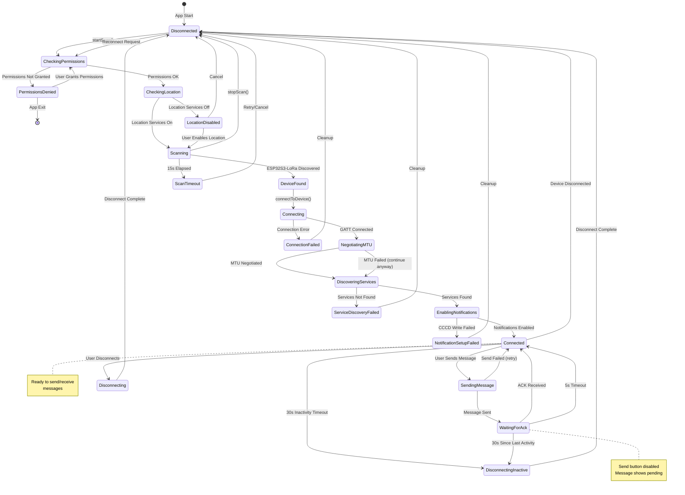
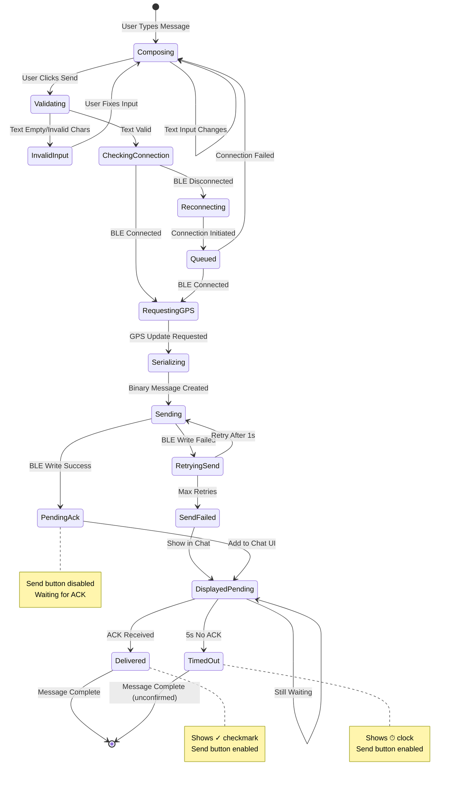
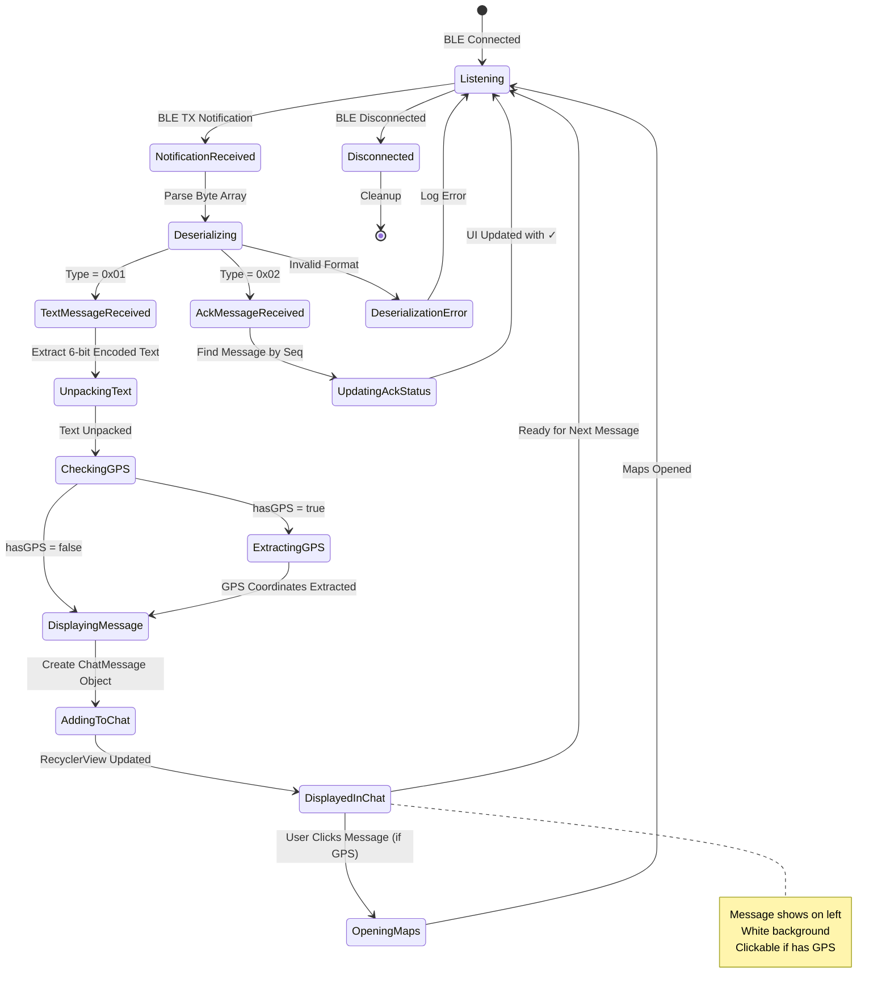
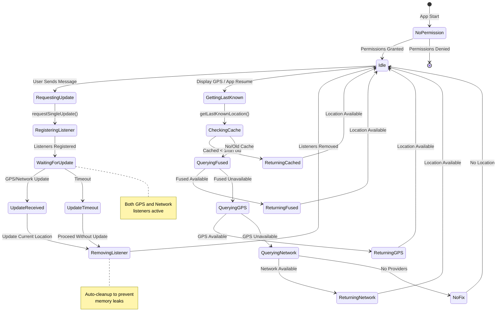
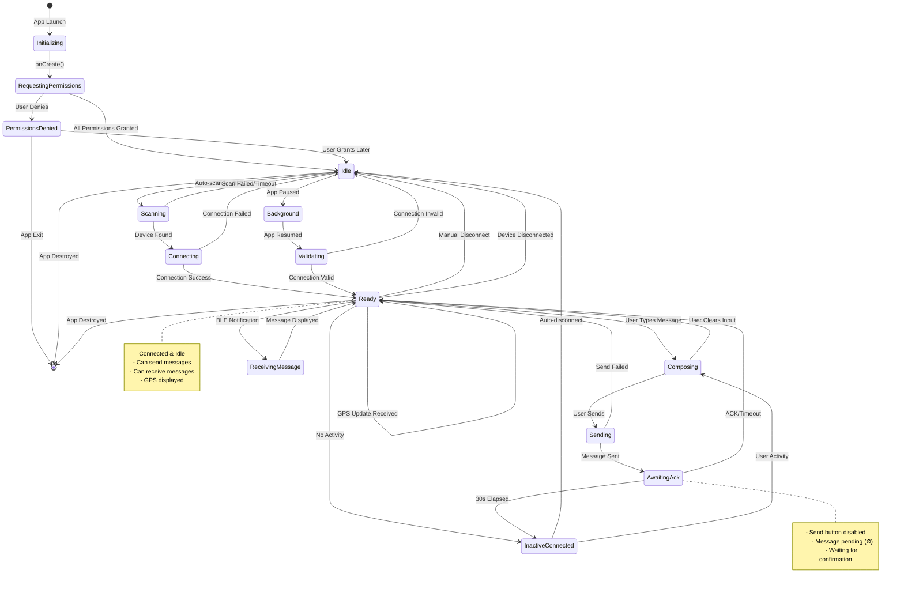
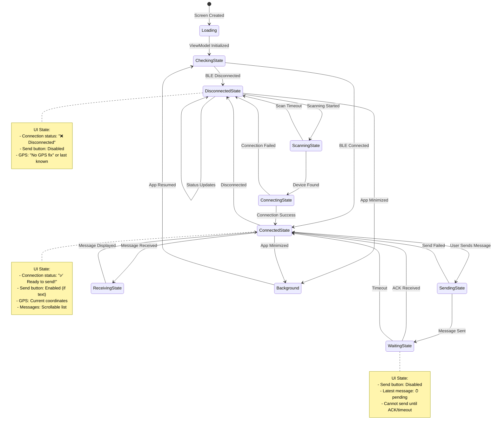

# LoRa Bridge - State Diagrams

This document contains state diagrams for the LoRa Bridge application using Mermaid syntax.

---

## 1. BLE Connection State Diagram



---

## 2. Message Lifecycle State Diagram



---

## 3. Message Reception State Diagram



---

## 4. GPS/Location State Diagram



---

## 5. Overall Application State Diagram



---

## 6. UI State Machine



---

## State Diagram Legend

### Connection Status Icons
- 🔍 Scanning...
- 📡 Connecting...
- 🔗 Negotiating...
- 🔧 Discovering services...
- ✅ Ready to send!
- ❌ Disconnected / Error states

### Message Status Icons
- ⏱ Pending (waiting for ACK)
- ✓ Delivered (ACK received)
- (no icon) Received message

### Colors (for implementation)
- Green: Success states
- Red: Error states
- Yellow/Orange: Warning states
- Blue: Active/processing states
- Gray: Inactive/waiting states

---

## Implementation Notes

1. **State Management**: Use sealed classes for each state machine:
   ```kotlin
   sealed class BleConnectionState {
       object Disconnected : BleConnectionState()
       object Scanning : BleConnectionState()
       object Connecting : BleConnectionState()
       object Connected : BleConnectionState()
       data class Error(val message: String) : BleConnectionState()
   }
   ```

2. **State Transitions**: Emit state changes via StateFlow:
   ```kotlin
   private val _connectionState = MutableStateFlow<BleConnectionState>(Disconnected)
   val connectionState: StateFlow<BleConnectionState> = _connectionState.asStateFlow()
   ```

3. **UI Reactions**: Collect states in Compose:
   ```kotlin
   val connectionState by viewModel.connectionState.collectAsState()
   when (connectionState) {
       is Connected -> ShowConnectedUI()
       is Scanning -> ShowScanningUI()
       // ...
   }
   ```

4. **Testing**: Each state transition should have unit tests verifying:
   - Valid transitions allowed
   - Invalid transitions prevented
   - Side effects triggered correctly
