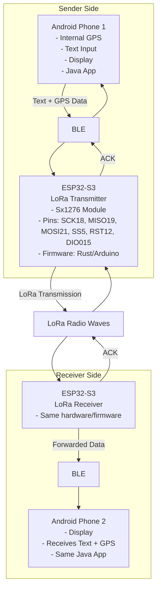

## Requirements

- **Communication Interface**: Bluetooth Low Energy (BLE) between Android phones and ESP32-S3 modules.
- **Hardware**: ESP32-S3 development board with Sx1276 LoRa module. Pin definitions as specified.
- **Firmware**: ESP32-S3 runs firmware in **Rust** using Embassy async framework.
- **Android App**: Java-based Android application that handles both sending and receiving messages and GPS coordinates.
- **Data Format**: Efficient binary format with minimal bytes for long-distance LoRa transmission, no encryption.
- **Features**: 
  - Send short text messages (max 50 characters) and GPS location from Phone 1 to Phone 2 via LoRa.
  - Receive messages and GPS on Phone 2.
  - Acknowledgments (ACK) sent back from receiver to sender to confirm delivery.
- **GPS**: Use Android phones' internal GPS for location data.

## Technical Specifications

### LoRa Radio Configuration
- **Frequency**: 433 MHz (ISM band)
- **Spreading Factor**: SF10 (optimized for long range)
- **Bandwidth**: 125 kHz (narrow for better sensitivity)
- **Coding Rate**: 4/5 (forward error correction)
- **Expected Range**: 5-10 km (open terrain), up to 15+ km in ideal conditions
- **Time on Air**: ~700ms for maximum message (61 bytes)
- **Power**: 20 dBm (maximum for SX1276)

### BLE Configuration
- **Service UUID**: 0x1234
- **TX Characteristic**: 0x5678 (ESP32 → Android notifications)
- **RX Characteristic**: 0x5679 (Android → ESP32 writes)
- **MTU**: Negotiated up to 512 bytes (typical 247+)
- **Buffer Size**: 64 bytes (sufficient for max 61-byte message)

### Message Protocol
- **Max Message Size**: 61 bytes (11-byte header + 50 chars text)
- **ACK Size**: 2 bytes
- **Text Encoding**: UTF-8
- **GPS Precision**: ±1 meter (coordinates × 1,000,000)
- **Sequence Numbers**: 0-255 with automatic wraparound

### Performance
- **Messages per Hour**: ~51 (within 1% duty cycle limit)
- **Latency**: ~1-2 seconds end-to-end (BLE + LoRa + BLE)
- **Battery Life**: Optimized with 64-byte buffers and efficient transmission