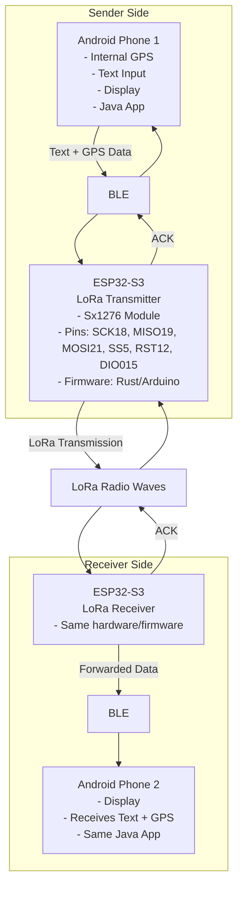

## Requirements

- **Communication Interface**: Bluetooth Low Energy (BLE) between Android phones and ESP32-S3 modules.
- **Hardware**: ESP32-S3 development board with Sx1276 LoRa module. Pin definitions as specified.
- **Firmware**: ESP32-S3 runs firmware in **Rust** using Embassy async framework.
- **Android App**: Java-based Android application that handles both sending and receiving messages and GPS coordinates.
- **Data Format**: Efficient binary format with minimal bytes for long-distance LoRa transmission, no encryption.
- **Features**: 
  - Send short text messages (max 50 characters) and GPS location from Phone 1 to Phone 2 via LoRa.
  - Receive messages and GPS on Phone 2.
  - Acknowledgments (ACK) sent back from receiver to sender to confirm delivery.
- **GPS**: Use Android phones' internal GPS for location data.

## Technical Specifications

### LoRa Radio Configuration
- **Frequency**: 433.92 MHz (default)
- **Spreading Factor**: SF10 (long range optimized)
- **Bandwidth**: 125 kHz
- **Coding Rate**: 4/5
- **TX Power**: 14 dBm / ~25 mW (default)
- **Expected Range**: 5-10 km typical (up to 15+ km ideal conditions)

*Configuration: See [LORA_CONFIG.md](LORA_CONFIG.md) for frequency/power configuration and regional limits.*

### BLE Configuration
- **Service UUID**: 0x1234
- **TX Characteristic**: 0x5678 (ESP32 → Android)
- **RX Characteristic**: 0x5679 (Android → ESP32)
- **MTU**: Up to 512 bytes
- **Buffer Size**: 64 bytes

### Protocol
See **[protocol.md](protocol.md)** for complete message format specification.

**Summary:**
- Max message: 61 bytes (50 chars text + 11 byte header)
- ACK: 2 bytes
- GPS precision: ±1 meter
- Latency: 1-2 seconds end-to-end

## See Also
- **[protocol.md](protocol.md)** - Binary message format specification
- **[LORA_CONFIG.md](LORA_CONFIG.md)** - Radio configuration and regional compliance
- **[README.md](README.md)** - Project overview and build instructions