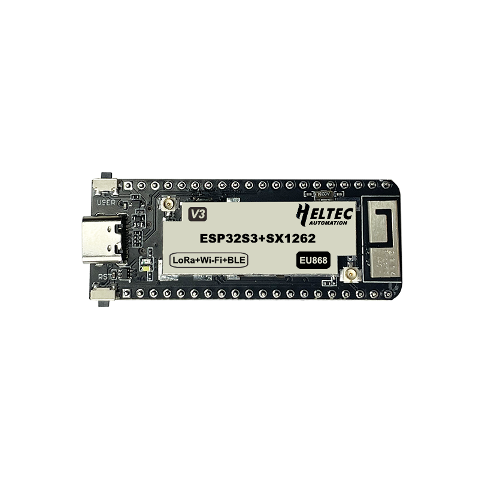
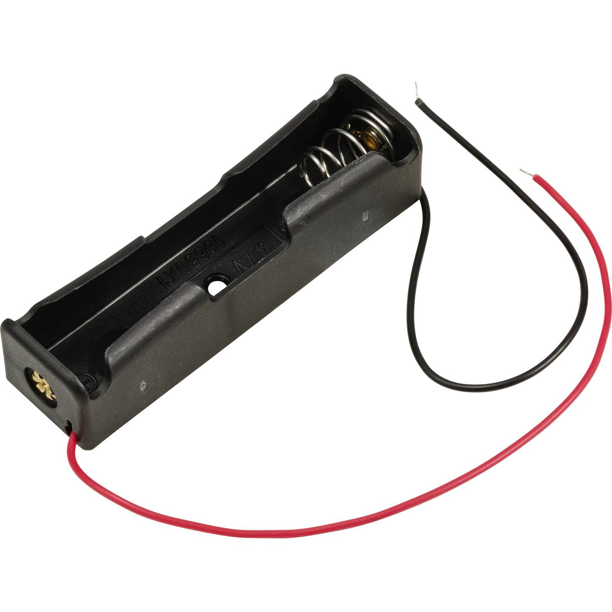
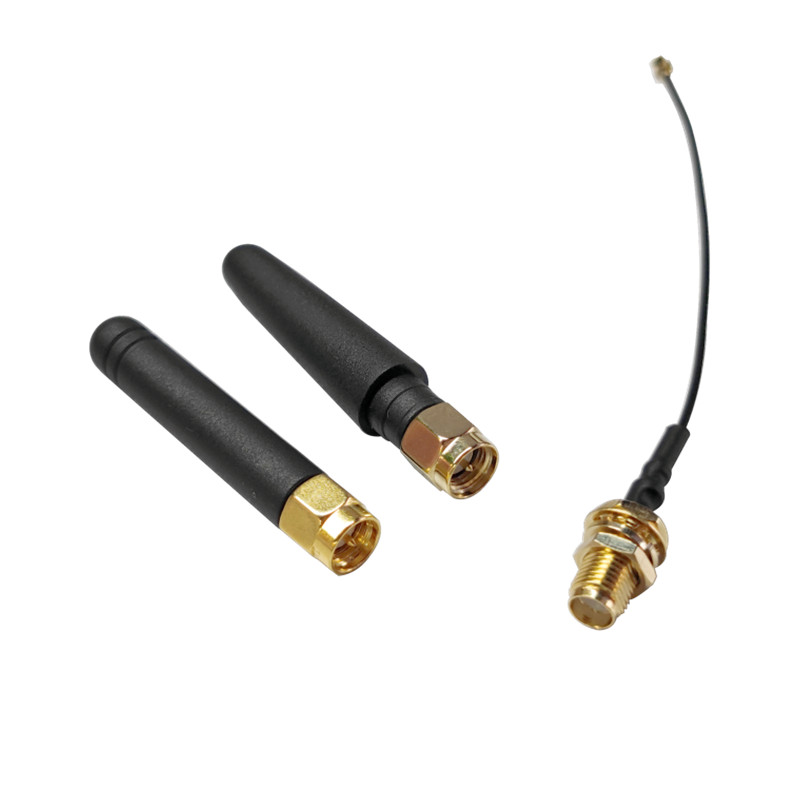

# Hardware Components

## Heltec Wireless Stick Lite (v3)

**Dimensions:** 58.08 × 22.6 × 8.2 mm

---

## 18650 Battery in Case

**Dimensions:** 76 × 21 × 18 mm

---

## Screws

**Specification:** 4× M3 × 20 mm screws with nuts

---

## USB-C Female Connector

**Type:** Female connector

---

## LoRa Antenna

**Specification:** 433 MHz, 5 cm length, SMA connector (connected via U.FL IPEX adapter)

---

## DIP Switch

**Dimensions:** 6 × 6 × 5 mm
