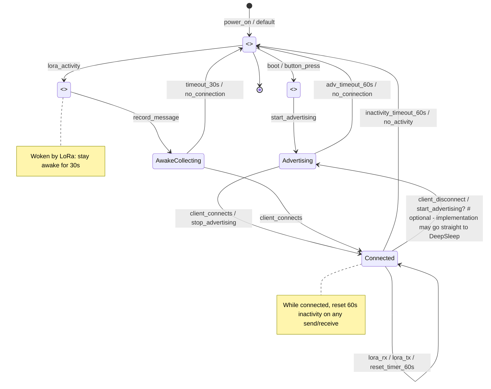

# ESP32 LoRa-BLE Gateway: Deep-sleep-first Power Policy (updated)

This document describes the new low-power design: the device is per default in  deep sleep state. It wakes on a boot/button press or LoRa activity. If a button is pressed we open a BLE pairing window and hope that a client connects. If nothing happens we return to deep sleep after 60 seconds.
If a client connects we stop advertising and wait for LoRa messages to forward. if we receive a lora message or send one we reset the 60 seconds timer. After 60 seconds of inactivity we return to deep sleep.

 LoRa messages received while the device is asleep must wake up the device. they survive deep sleep so they can be forwarded later when paired. if device was woken up from lora we want to stay awake for 30 second to allow for more messages to arrive.

## Use cases

1. Actor: User (button press)
	 - Preconditions: Device is in deep sleep or idle. Battery has sufficient charge.
	 - Basic flow:
		 1. User presses the wake/pair button (or boots the device manually).
		 2. Device boots or wakes and opens a BLE pairing window (starts advertising).
		 3. If a client connects within 60 seconds, stop advertising and remain awake to forward LoRa messages.
		 4. If no client connects within 60 seconds, device returns to deep sleep.
	 - Postconditions:
		 - Connected: device is awake and forwarding messages until inactivity timeout.
		 - No connection: device is in deep sleep.

2. Actor: LoRa network (incoming message)
	 - Preconditions: Device may be in deep sleep or awake.
	 - Basic flow when asleep:
		 1. LoRa activity (message received) triggers wake-from-LORA interrupt.
		 2. Device wakes and records the received message(s) persisted across deep sleep.
		 3. If a BLE client is paired/connected, forward the message immediately and reset inactivity timer.
		 4. If no client is connected, stay awake for 30 seconds to allow more LORA messages; then return to deep sleep if still unpaired.
	 - Basic flow when awake:
		 1. Device receives LoRa message while awake and, if paired, forwards it immediately.
		 2. Receiving or sending a LoRa message resets the activity timer (60 seconds while paired, 30 seconds when woken by LoRa).
	 - Postconditions:
		 - Messages are forwarded when possible, or persisted for later forwarding after wake.

3. Actor: BLE client (connects/disconnects)
	 - Preconditions: Device is advertising (after user wake) or already connected.
	 - Basic flow (connect):
		 1. BLE client discovers and connects to the device while advertising.
		 2. Device stops advertising and enters connected state, waiting for LoRa messages to forward.
	 - Basic flow (disconnect):
		 1. BLE client disconnects or connection lost.
		 2. Device starts/restarts the inactivity timer; if no activity within 60 seconds it returns to deep sleep.
	 - Postconditions:
		 - Connected: normal forward mode.
		 - Disconnected: may return to deep sleep after timeout.

4. Actor: System boot / firmware update
	 - Preconditions: Device powers on (external power or reset).
	 - Basic flow:
		 1. Device boots into normal startup and then follows deep-sleep-first policy (enter deep sleep unless button/LoRa wake forces remain-awake behavior).
	 - Postconditions: Device follows the state machine defined below.

### Edge cases
 - Multiple LoRa messages arriving during deep sleep: all should be preserved and forwarded when a client is available.
 - Rapid connect/disconnect cycles: timer logic must be resilient to avoid thrashing (restart timer on each relevant event).
 - Low-battery: device should still follow deep-sleep-first policy; consider aborting advertising if battery critically low (implementation note).

## State Diagram (Mermaid)

The following Mermaid diagram models the power states and transitions described above. It includes wake sources, advertising/connected states, and inactivity timers (60s and 30s).

## Verification notes
 - Timers: 60s for user-initiated pairing/session activity; 30s for wakes triggered by LoRa while unpaired.
 - Persistence: LoRa messages received during sleep should be stored in non-volatile or retained RAM across deep sleep depending on hardware capability.

---

Updated to include explicit use cases and a state diagram to guide implementation and testing.

