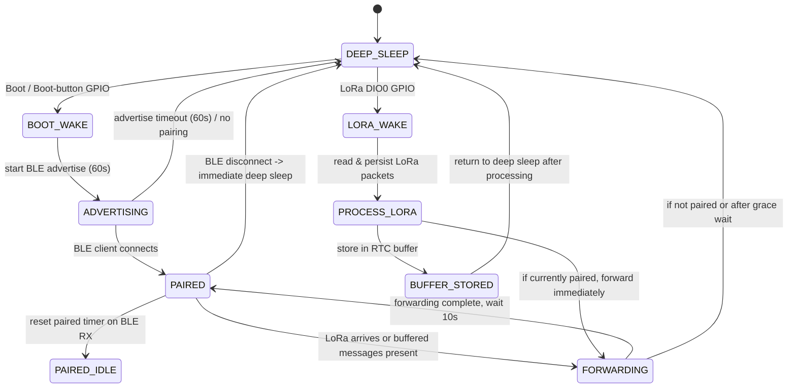

# ESP32 LoRa-BLE Gateway: Deep-sleep-first Power Policy (updated)

This document describes the new low-power design: the device spends most of its time in deep sleep. It wakes on a boot/button press or LoRa activity, briefly opens a BLE pairing window, and otherwise returns to deep sleep. LoRa messages received while the device is asleep must survive deep sleep so they can be forwarded later when paired.

## Summary of new policy

- Default mode: DEEP SLEEP (lowest power). The device only wakes for explicit events.
- Wake sources:
  - Boot / user boot-button press (GPIO wake) — used to start a BLE pairing window.
  - LoRa DIO0 (GPIO) — a LoRa receive event should wake the chip from deep sleep.
  - Optional RTC timer (used for short post-forward delays).
- BLE pairing window: 60 seconds after boot-button wake. If no pairing occurs within 60s, device returns to deep sleep.
- Paired/connected state: when a BLE client connects, the device stays awake for up to 60 seconds (paired window). Each received BLE message from the client restarts this 60s window. If the client disconnects, the device immediately goes back to deep sleep.
- LoRa behavior while sleeping: LoRa DIO0 wake will cause the MCU to wake, read and store all pending LoRa messages, persist them across deep sleep, and then go back to deep sleep (or follow forwarding logic described below).
- Forwarding behavior when paired: If the device is currently paired (connected) when it wakes for LoRa, buffered messages should be forwarded to the Android app. After forwarding (or if forwarding was attempted), the device returns to deep sleep after a short grace period (10 seconds) to allow the app to receive/acknowledge.

## Timers and windows

- Pairing/advertise window after boot-button: 60 seconds.
- Paired (connected) maximum idle window: 60 seconds. Any BLE RX activity resets this 60s window.
- After forwarding buffered LoRa messages while paired, wait 10 seconds then re-enter deep sleep.

## Message buffer persistence across deep sleep

We must ensure LoRa messages survive deep sleep. Options:

- RTC slow memory (RTC_DATA_ATTR): Fast and simple for small buffers and short deep-sleep cycles. Data in RTC slow memory remains across deep sleep cycles.
- NVS (non-volatile storage): Persistent across power cycles; good for larger buffers or if messages must survive a full power loss.

Recommendation: use RTC slow memory (RTC_DATA_ATTR) for the in-RAM circular buffer when message size and capacity are modest (the existing `MessageBuffer` is small — e.g. 10 messages). If you need durability across power-off, add optional NVS persistence as a fallback when RTC buffer becomes full or on graceful shutdown.

Implementation notes:

- Mark the in-memory buffer structure with `RTC_DATA_ATTR` so it survives deep sleep. Ensure pointers are simple offsets/indices (no raw heap pointers across deep sleep).
- Keep the buffer bounded and lock-free for ISR + main context (use critical sections around head/tail updates). Overwrite oldest on overflow.

## State-machine contract (concise)

- Inputs: boot-button wake, LoRa GPIO wake (DIO0), BLE connect/disconnect events, BLE RX messages, RTC timer wake for short grace delays.
- Outputs: start/stop BLE advertising, enter deep sleep, persist or load message buffer, forward buffered messages on connect.

Success criteria:

- Device remains in deep sleep unless explicitly woken by boot-button or LoRa.
- Boot-button wake opens BLE advertising for 60s; if connected, device remains awake for up to 60s of inactivity, reset by BLE RXs; manual or automatic disconnect -> immediate deep sleep.
- LoRa messages received while asleep wake the device and are persisted across deep sleep; if device is paired, messages are forwarded and device re-enters deep sleep 10s after forwarding.

## Edge cases and constraints

- LoRa RX arrival while BLE connected: treat as live-forward (do not deep-sleep). Make sure forwarding is thread-safe with ISR.
- Buffer overflow: overwrite oldest message and log warning.
- BLE connect race during forwarding: only forward the snapshot of buffer present at connect start, leaving new arrivals in buffer for future wakes.
- Ensure buffer uses RTC-safe primitives (no malloc/references across deep sleep).

## Testing checklist

1. Power on the device normally: it should immediately enter deep sleep unless powered by serial/debugger.
2. Press the boot button: device should wake and advertise for BLE for 60s.
3. If no pairing in 60s: device should return to deep sleep.
4. Pair from the Android app within 60s: device should stay awake and be in a paired window for up to 60s; sending BLE messages from the app should reset that 60s window.
5. If the app disconnects: device should immediately go to deep sleep.
6. While the device is deep sleeping, send a LoRa message that triggers DIO0: device must wake, buffer the message in RTC memory, and return to deep sleep promptly.
7. After pairing, ensure buffered LoRa messages are delivered; after forwarding, device should go back to deep sleep after ~10s.
8. Test buffer overflow by sending >capacity LoRa messages while asleep; oldest messages should be overwritten and the behavior logged.

## Next steps I will take now

1. Inspect `PowerController.h`/`.cpp` and `MessageBuffer.h`/`.cpp` to determine how to mark the buffer with `RTC_DATA_ATTR` and where to add wake-cause logic.
2. Implement the deep-sleep control in `PowerController` and adapt `MessageBuffer` to be RTC-safe.

## State diagram

Below is a mermaid state diagram that visualizes the deep-sleep-first behavior and the main wake/transition paths.

