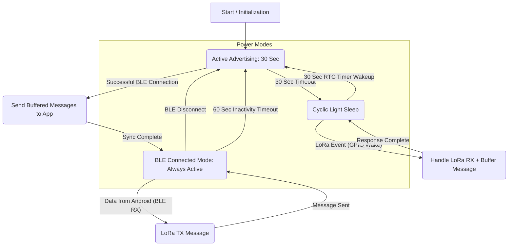

# **ESP32 LoRa-BLE Gateway: Use Cases**

This document outlines the primary user scenarios and system behaviors based on the power-saving architecture.

## **1\. Device Startup**

* **Action:** The device is powered on or reset.  
* **Response:** The system initializes and immediately enters "Active Advertising" mode for 30 seconds to allow a user to connect.

## **2\. Disconnected & Idle**

* **Scenario:** The device is on but not connected to the Android app.  
* **Behavior:** The device is in a power-saving loop:  
  1. **Advertise:** Actively advertises via BLE for 30 seconds.  
  2. **Sleep:** Enters Light Sleep for 30 seconds.  
  3. This cycle repeats, ensuring the device is periodically discoverable while saving power.

## **3\. Receiving LoRa Data (While Disconnected)**

* **Scenario:** A LoRa message arrives while the device is in its 30-second Light Sleep state.  
* **Behavior:**  
  1. The LoRa module triggers a GPIO pin, instantly waking the ESP32.  
  2. The device receives the LoRa message.  
  3. The message is stored in an internal buffer (to be delivered later).  
  4. The device immediately goes back to Light Sleep (it does not wait for the 30-second sleep timer to finish).

## **4\. Connecting the Android App**

* **Scenario:** The user opens the Android app and connects to the device (during its 30-second advertising window).  
* **Behavior:**  
  1. A BLE connection is established.  
  2. The device *immediately* uploads the entire buffer of stored LoRa messages to the app.  
  3. After the sync is complete, the device enters the "Always Active" connected mode.

## **5\. Relaying App Message to LoRa (While Connected)**

* **Scenario:** The user is connected and sends a message from the app.  
* **Behavior:**  
  1. The device is in "Always Active" mode (no power saving).  
  2. It receives the message via BLE.  
  3. It immediately transmits that message over the LoRa radio.  
  4. It stays active, awaiting the next command.

## **6\. Disconnecting the App (Manual)**

* **Scenario:** The user manually disconnects from the device within the app.  
* **Behavior:**  
  1. The BLE connection is terminated.  
  2. The device immediately reverts to the "Disconnected & Idle" power-saving loop (starting with 30 seconds of advertising).

## **7\. Disconnecting (Automatic Inactivity)**

* **Scenario:** The device is connected, but there is no communication (no BLE or LoRa activity) for 60 seconds.  
* **Behavior:**  
  1. The 60-second inactivity timer expires.  
  2. The device *automatically* terminates the BLE connection to save power.  
  3. The device reverts to the "Disconnected & Idle" power-saving loop (starting with 30 seconds of advertising).

## State-machine contract (concise)

- Inputs: BLE connect/disconnect events, BLE RX messages, LoRa RX (GPIO/ISR), RTC timer wake (30s), manual disconnect, inactivity timer (60s).
- Outputs: Start/stop BLE advertising, enter/exit light-sleep, send buffered messages to BLE on connect, enable "always active" mode while connected, forward BLE->LoRa messages immediately.
- Error modes: buffer overflow (drop oldest message), BLE send failure (retry limited, stop on repeated failure), wake while processing (process then return to sleep as appropriate).

Success criteria:
- While disconnected the device alternates: Advertise 30s -> Light Sleep 30s (RTC wake). During sleep, a LoRa GPIO interrupt must wake the MCU, the LoRa payload must be buffered and the MCU may return to sleep immediately after buffering.
- On BLE connect the device uploads all buffered LoRa messages to the app (as soon as BLE is ready) and remains always-active until a manual disconnect or a 60s inactivity timeout.

### Edge cases to watch

- LoRa RX arrives while BLE is connected: handle as live-forward (no buffering) and do not enter sleep. Ensure concurrency between IRQ and BLE TX.
- Multiple LoRa messages during sleep: GPIO wake should cause the MCU to process all pending LoRa packets from the LoRa queue and buffer them if disconnected; buffer overflow policy: overwrite oldest.
- BLE connect race: phone connects while buffered messages are being delivered — ensure delivery is atomic from buffer perspective (send everything present at connect time, then continue live forwarding).
- Inactivity timer vs manual disconnect: manual disconnect should immediately cancel inactivity timer and go to disconnected loop; inactivity timer reached should forcefully disconnect BLE and start the disconnected loop.
- Failure to send buffered messages (BLE TX fail): stop the upload, keep remaining messages in buffer and retry on next connect.

## File mapping (where behaviors live today)

- `src/main.cpp`
  - Initializes BLE, LoRa, power management and wake GPIOs.
  - Registers `onLoRaReceive` ISR which queues LoRa packets.
  - Contains `handleLoRaToBleForwarding()` and `processLoRaPacket()` which implement buffering and forwarding logic (buffer stored in global `MessageBuffer messageBuffer`).

  - Implements esp_pm locks for temporarily disabling light sleep and boosting CPU during LoRa TX. Does not orchestrate advertise/sleep cycles.

- `include/MessageBuffer.h`
  - Circular buffer for up to 10 messages. Ready for use by the power flow.

- `src/BLEManager.cpp` and `include/BLEManager.h`
  - BLE GATT server, advertising control, connection callbacks, `sendMessage()` and `onMessageReceived()`.
  - Exposes `updateActivity()` and `isConnected()` which are useful for inactivity handling.

## Next implementation steps (short)

1. Add a small `PowerController` (or extend main loop) to implement the disconnected advertising/light-sleep cycle (30s advertise, 30s light-sleep) using RTC timer wake and `gpio_wakeup_enable` for LoRa DIO0.
2. Modify BLE connection handling to immediately upload the `messageBuffer` contents on connect (remove the current 2s hold unless a short stabilization delay is required). Ensure partial failures keep remaining messages in buffer.
3. Add a 60s inactivity timer that resets on BLE/LoRa activity; when expired, force disconnect and revert to the disconnected cycle.
4. Add small test instructions to validate: (a) LoRa RX during sleep causes wake and buffering, (b) BLE connect triggers immediate buffer sync, (c) inactivity disconnect works.

If you want I can now implement step 1 and 3 (PowerController + inactivity timer) in code and run a quick build to ensure no compile errors. After that I'll implement immediate buffered upload behavior.
