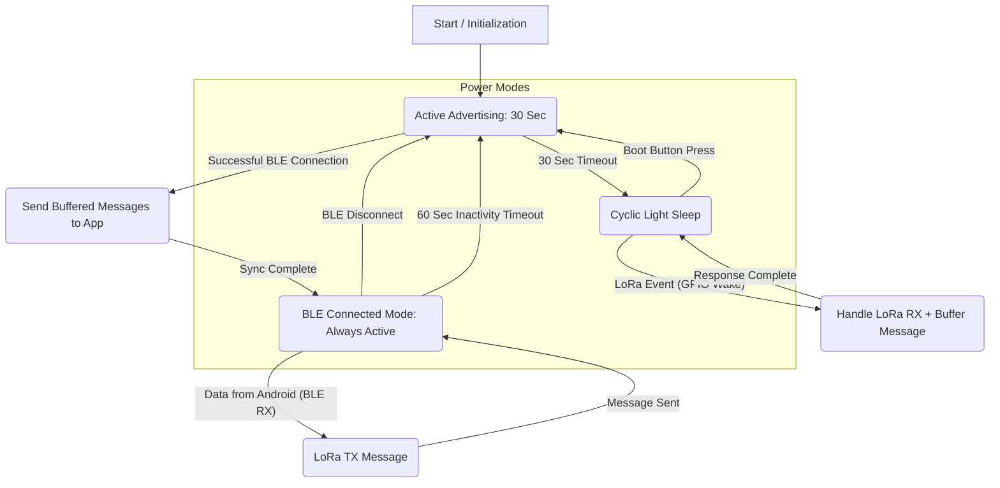

# **ESP32 LoRa-BLE Gateway: Use Cases**

This document outlines the primary user scenarios and system behaviors based on the power-saving architecture.

---

## **Power Optimization: Rx Duty Cycle Mode**

### Overview

The SX1262 LoRa radio supports **hardware-autonomous Rx Duty Cycle mode** using RadioLib's `startReceiveDutyCycleAuto()` which significantly reduces power consumption while waiting for incoming messages during deep sleep.

### Power Consumption

**SX1262 (Heltec WiFi LoRa V3) with Autonomous Duty Cycle:**
- ESP32 in deep sleep: ~10 μA
- SX1262 autonomous duty cycle: ~1.5-2 mA (managed by RadioLib)
- **Total: ~2 mA**
- Battery life (2500 mAh): ~1250 hours (~52 days)

**SX1278 (LilyGo T-Display-S3 Debugger) with Continuous RX:**
- ESP32 in deep sleep: ~10 μA
- SX1278 continuous RX: ~12 mA
- **Total: ~12 mA**
- Battery life (2500 mAh): ~208 hours (~8.7 days)
- Acceptable for USB-powered debuggers and test devices

### Configuration (platformio.ini)

```ini
# All devices use same LoRa parameters for interoperability
[env]
build_flags =
    -DLORA_FREQUENCY=433.92
    -DLORA_BANDWIDTH=250.0          # Changed from 31.25 (8x faster airtime)
    -DLORA_SPREADING_FACTOR=11
    -DLORA_CODING_RATE=5
    -DLORA_TX_POWER=20
    -DENABLE_RX_DUTY_CYCLE          # SX1262 only (SX1278 ignores)
```

### How It Works

1. **RadioLib manages duty cycle timing automatically** (hardcoded in library)
2. SX1262 radio chip independently wakes periodically to listen for preamble
3. ESP32 can be in deep sleep - no CPU involvement needed
4. When 512-symbol preamble detected (~2.5s), radio stays awake for full message
5. Radio triggers DIO1 interrupt, waking ESP32 from deep sleep
6. ESP32 processes message, returns to deep sleep
7. SX1262 continues autonomous duty cycling

**Key Insight:** The radio's duty cycle is **independent from ESP32 deep sleep**. The radio manages itself while ESP32 sleeps.

### Transmission Strategy

**512-Symbol Preamble:**
```cpp
// In LoRaManager::begin()
radio->setPreambleLength(512);  // ~2.5s at SF11/BW250
```

**How it works:**
- Long preamble (~2.5s) spans multiple receiver RX windows
- Single transmission reliably wakes duty-cycled receivers  
- Also works for continuous RX receivers (preamble just longer)
- Preamble is part of LoRa packet structure (handled by RadioLib)
- No separate wake-up packets needed!

### Compatibility

- **SX1262 devices:** Autonomous duty cycle (~2 mA) when `ENABLE_RX_DUTY_CYCLE` defined
- **SX1278 devices:** Continuous RX (~12 mA) - acceptable for USB-powered debuggers
- **Mixed networks:** SX1262 ↔ SX1278 communication works perfectly
- **Deep sleep:** Fully compatible - radio operates independently

### Airtime Performance

**Message transmission time at SF11, BW250 kHz:**
- Typical message (~25 chars + GPS): ~0.8 seconds
- Empty message: ~0.5 seconds
- Maximum message (50 chars + GPS): ~1.0 seconds

**Benefits:**
- Fast airtime reduces collisions
- Improved responsiveness
- More messages possible within duty cycle limits

### Testing

To disable duty cycle mode for testing:

```cpp
// In platformio.ini, comment out:
// -DENABLE_RX_DUTY_CYCLE
```

SX1262 firmware will automatically fall back to continuous RX mode (12 mA).

---

## **1\. Device Startup**

* **Action:** The device is powered on or reset.  
* **Response:** The system initializes and immediately enters "Active Advertising" mode for 30 seconds to allow a user to connect.

## **2\. Disconnected & Idle**

* **Scenario:** The device is on but not connected to the Android app.
* **Behavior:** The device is in a power-saving loop:
  1. **Advertise:** Actively advertises via BLE for 30 seconds.
  2. **Sleep:** Enters Light Sleep indefinitely until woken by boot button press or LoRa activity.
  3. Press the boot button (GPIO0) to wake the device and restart advertising.
  4. This cycle ensures maximum power savings while allowing manual wake via button.

## **3\. Receiving LoRa Data (While Disconnected)**

* **Scenario:** A LoRa message arrives while the device is in Light Sleep state.
* **Behavior:**
  1. The LoRa module triggers a GPIO pin (DIO0), instantly waking the ESP32.
  2. The device receives the LoRa message.
  3. The message is stored in an internal buffer (to be delivered later).
  4. **The device starts advertising for 30 seconds** so the user can connect and retrieve the buffered message.
  5. If no connection is made during the 30-second advertising window, the device returns to Light Sleep.

## **4\. Connecting the Android App**

* **Scenario:** The user presses the boot button (or a LoRa message arrives) to wake the device, which starts advertising. The user then opens the Android app and connects during the 30-second advertising window.
* **Behavior:**
  1. A BLE connection is established.
  2. The device waits 1000ms for Android BLE stack setup (MTU negotiation, service discovery, notification enablement).
  3. After the stabilization period, the device uploads the entire buffer of stored LoRa messages to the app.
  4. After the sync is complete, the device enters the "Always Active" connected mode.
  5. **A 60-second inactivity timer starts.** The device will remain active and connected for at least 60 seconds.
  6. Any BLE or LoRa activity resets the timer back to 60 seconds.

## **5\. Relaying App Message to LoRa (While Connected)**

* **Scenario:** The user is connected and sends a message from the app.
* **Behavior:**
  1. The device is in "Always Active" mode (no power saving while connected).
  2. It receives the message via BLE.
  3. It immediately transmits that message over the LoRa radio.
  4. **Any BLE or LoRa activity resets the 60-second inactivity timer.**
  5. It stays active, awaiting the next command.

## **6\. Disconnecting the App (Manual)**

* **Scenario:** The user manually disconnects from the device within the app.  
* **Behavior:**  
  1. The BLE connection is terminated.  
  2. The device immediately reverts to the "Disconnected & Idle" power-saving loop (starting with 30 seconds of advertising).

## **7\. Disconnecting (Automatic Inactivity)**

* **Scenario:** The device is connected, but there is no communication (no BLE or LoRa activity) for 60 seconds.
* **Behavior:**
  1. When BLE connects, the device stays fully active (no light sleep) for at least 60 seconds.
  2. **Any BLE or LoRa activity automatically renews the 60-second timer.**
  3. After 60 seconds of complete inactivity (no BLE messages, no LoRa packets), the inactivity timer expires.
  4. The device *automatically* terminates the BLE connection to save power.
  5. The device reverts to the "Disconnected & Idle" power-saving loop (starting with 30 seconds of advertising).



## State-machine contract (concise)

- Inputs: BLE connect/disconnect events, BLE RX messages, LoRa RX (GPIO/ISR), boot button press (GPIO0), manual disconnect, inactivity timer (60s).
- Outputs: Start/stop BLE advertising, enter/exit light-sleep, send buffered messages to BLE on connect, enable "always active" mode while connected, forward BLE->LoRa messages immediately.
- Error modes: buffer overflow (drop oldest message), BLE send failure (retry limited, stop on repeated failure), wake while processing (process then return to sleep as appropriate).

Success criteria:
- While disconnected the device alternates: Advertise 30s -> Light Sleep (indefinite, wake on button/LoRa). During sleep, a LoRa GPIO interrupt or boot button press must wake the MCU. **After waking (from button OR LoRa), the device restarts advertising for 30 seconds.** LoRa payloads are buffered during this time.
- On BLE connect the device uploads all buffered LoRa messages to the app (as soon as BLE is ready) and remains always-active with a 60-second inactivity timer.
- **While connected:** Any BLE message (TX/RX) or LoRa activity resets the 60-second inactivity timer. After 60 seconds of complete inactivity, the device disconnects BLE and returns to the sleep cycle.
- **Activity tracking:** BLE activity is tracked via callbacks in BLEManager (onMessageReceived, onConnected). LoRa activity is tracked via notifyActivity() calls in ApplicationController after packet processing.

### Edge cases to watch

- LoRa RX arrives while BLE is connected: handle as live-forward (no buffering) and do not enter sleep. Ensure concurrency between IRQ and BLE TX.
- Multiple LoRa messages during sleep: GPIO wake should cause the MCU to process all pending LoRa packets from the LoRa queue and buffer them if disconnected; buffer overflow policy: overwrite oldest.
- BLE connect race: phone connects while buffered messages are being delivered — ensure delivery is atomic from buffer perspective (send everything present at connect time, then continue live forwarding).
- Inactivity timer vs manual disconnect: manual disconnect should immediately cancel inactivity timer and go to disconnected loop; inactivity timer reached should forcefully disconnect BLE and start the disconnected loop.
- Failure to send buffered messages (BLE TX fail): stop the upload, keep remaining messages in buffer and retry on next connect.

## File mapping (where behaviors live today)

- `src/main.cpp`
  - Initializes BLE, LoRa, power management and wake GPIOs.
  - Registers `onLoRaPacketReceived()` callback which queues LoRa packets to loraToBleQueue.
  - Thin main loop that delegates to ApplicationController.

- `src/ApplicationController.cpp` and `include/ApplicationController.h`
  - Central state machine coordinating all power management, advertising, and sleep behaviors.
  - Implements 4 states: DISCONNECTED_ADVERTISING, CONNECTED_ACTIVE, CONNECTED_IDLE, SLEEPING.
  - Handles message buffering and forwarding between BLE and LoRa.
  - Enforces advertising duration (30s) and inactivity timeout (60s) policies.
  - Coordinates with PowerManager for sleep transitions.

- `src/PowerManager.cpp` and `include/PowerManager.h`
  - Stateless hardware-level power management functions.
  - Configures CPU frequency scaling and GPIO wakeup sources.
  - Provides `enterLightSleep()` for blocking sleep entry.
  - No application logic - purely hardware control.

- `include/MessageBuffer.h`
  - Circular buffer for up to 10 messages (stores messages when BLE disconnected).
  - Used by ApplicationController for offline message storage.

- `src/BLEManager.cpp` and `include/BLEManager.h`
  - BLE GATT server, advertising control, connection callbacks.
  - Provides `sendMessage()`, `onMessageReceived()`, `isConnected()`.
  - Thin wrapper around NimBLE with minimal application logic.

- `include/FirmwareConfig.h`
  - Centralized configuration constants for all timing policies.
  - Key constants: ADVERTISE_DURATION_MS (30s), INACTIVITY_TIMEOUT_MS (60s), CONNECTION_SETUP_DELAY_MS (1000ms).

## Implementation Status

✅ **Completed** - All core power-saving features are implemented:

1. ✅ Disconnected advertising/light-sleep cycle (30s advertise, then sleep until GPIO wakeup)
2. ✅ Buffered message upload on connect (with 1000ms stabilization delay for Android)
3. ✅ 60s inactivity timer with automatic disconnect
4. ✅ Activity tracking that resets inactivity timer on BLE/LoRa events
5. ✅ GPIO wakeup configuration for boot button (GPIO0) and LoRa DIO0
6. ✅ State machine architecture (ApplicationController + stateless PowerManager)

## Testing Checklist

Manual validation tests:

- [ ] **LoRa wake from sleep**: Send LoRa message while device is sleeping, verify device wakes and starts advertising
- [ ] **Buffered message delivery**: While disconnected, receive LoRa messages, then connect and verify all buffered messages are uploaded
- [ ] **Inactivity disconnect**: Connect via BLE, wait 60s with no activity, verify device disconnects automatically
- [ ] **Activity timer reset**: While connected, send BLE or LoRa message every 30s, verify connection stays alive beyond 60s
- [ ] **Advertising timeout**: Power on device without connecting, verify it advertises for 30s then enters sleep
- [ ] **Boot button wake**: Press boot button while sleeping, verify device wakes and starts advertising
