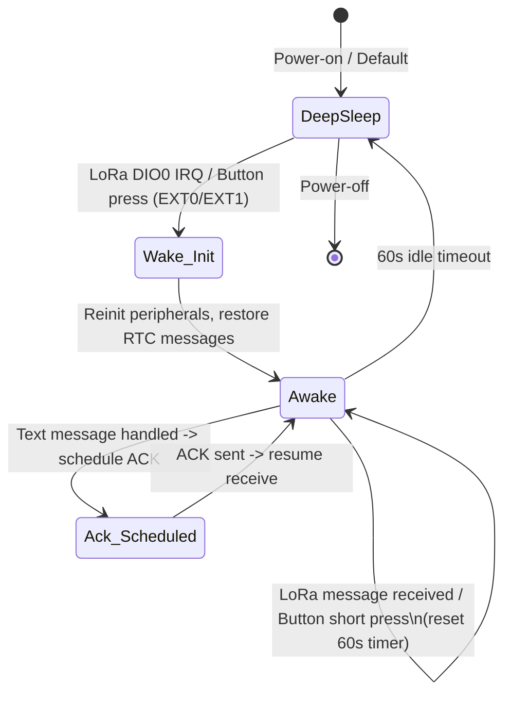

# Deep-sleep-first LoRa receiver — Requirements (for review)

## Overview

Make the device sleep by default and only wake for relevant events. On wake it stays awake for a short window to process messages and user actions. Persist up to 10 latest received messages across deep sleep using RTC memory (user preference).

High-level goals:
- Wake on LoRa RX interrupt (DIO0) or user button.
- After wake, remain awake for 60 seconds; each received LoRa message resets that interval.
 - Short button press when awake sends a test message; long press while awake is ignored (no manual deep sleep).
- Persist up to 10 latest messages across deep sleep using RTC memory (fixed-size circular buffer).

---

## Functional requirements

2. Wake sources
   - LoRa DIO0 (EXT1, wake on any-high): wake from deep sleep on incoming LoRa packet interrupt.
   - Button (EXT0, active LOW): wake from deep sleep on button press.

3. Awake behavior
   - On any wake, reinitialize peripherals as needed (display, LoRa) and begin a 60-second awake timer.
   - If a LoRa message is received while awake: process it, persist it to RTC circular buffer, update display, and reset the 60s awake timer.
   - Multiple messages during the awake window extend the awake window (60s from last message).
   - If the 60s period expires with no new messages or button interactions, return to deep sleep.

4. Button behavior
   - From deep sleep: a short press wakes the device (EXT0); the user then has the 60s awake window.
   - While awake:
     - Short press: send a small test text message over LoRa and remain awake (resets 60s).

5. Persistence
   - Store up to the 10 latest received messages in RTC memory so they survive deep-sleep cycles.
   - RTC layout: fixed-size slots (no dynamic allocation in RTC area), each slot stores message bytes (bounded size), length and metadata (rssi, snr, sequence if present).
   - On wake, restore and display the persisted messages (most recent first or as a chronological timeline—see Use Cases).
   - RTC memory is not required to survive a power-cut (full power loss). This is acceptable.

6. ACKs and TX flow
   - Existing ACK behavior remains: when a text message arrives, schedule an ACK after a short delay (e.g., 500 ms) to allow sender to switch RX/TX as currently implemented.
   - Ensure ACK sending and immediate return to RX mode work reliably when awake.

---

## Non-functional requirements

- Use RTC memory (`RTC_DATA_ATTR`) for persistence to avoid flash wear and minimize latency.
- Total RTC memory footprint must be small and deterministic: fixed slot count (10) and fixed per-slot buffer (suggested max ~256 bytes — validate for memory constraints).
- Minimal power overhead: keep wake events short and avoid unnecessary peripheral initialization when not needed.
- Robustness: validate persisted data on restore (length bounds, checksum optional) and skip corrupt entries.
- Low-latency wake: configure LoRa DIO0 as an RTC wake source to minimize wake path latency.

---

## Data model (high-level, no code)

- Persistent circular buffer in RTC memory:
  - slots = 10
  - each slot contains:
    - length (uint16)
    - rssi (int16)
    - snr (float or scaled int)
    - message bytes (fixed-length byte array, e.g., 256B)
  - two RTC indices:
    - head (next write index)
    - count (number of valid slots, 0..10)
  - Write policy: write newest message at `head`, increment head modulo slots, if count < slots then count++ else overwrite oldest.

- In-RAM runtime buffer (volatile) for display history:
  - keep a separate ring or array sized to screen capacity; restored messages are merged into this view on wake.

---

## Use cases / user stories

1. Idle battery-powered receiver (normal operation)
   - Behavior: device is in deep sleep.
   - Event: remote transmitter sends a LoRa message.
   - Result: LoRa DIO0 wakes device; device boots, restores RTC messages to display, processes incoming message, stores incoming message to RTC buffer, displays message, schedules ACK, stays awake for 60s; if no further messages or interactions, returns to deep sleep.

2. Local inspection (user checks device)
  - Behavior: device in deep sleep.
  - Event: user presses the button shortly.
  - Result: device wakes, restores persisted messages to display, remains awake for 60s. Short presses while awake send test messages; long presses have no special effect.

3. High-traffic moment
   - Behavior: device awake (within 60s).
   - Event: series of LoRa messages arrives.
   - Result: each message is processed and appended to display; RTC buffer is updated in a circular manner; awake timer resets on each message, keeping the device awake until 60s after last message.

4. Corrupt RTC entry
  - Behavior: on wake, one of the persisted entries has an invalid length or obviously corrupted data.
  - Result: skip the corrupted slot, continue restoring other entries, log/indicate on display if possible.
   - Behavior: on wake, one of the persisted entries has an invalid length or obviously corrupted data.
   - Result: skip the corrupted slot, continue restoring other entries, log/indicate on display if possible.

---

## Acceptance criteria (testable)

- Power-on: device immediately enters deep sleep when reset by power-on (unless reset triggered by a wake source).
- LoRa wake: sending a LoRa message to device triggers wake from deep sleep; the message is processed and persists to RTC memory.
- Awake window: device stays awake at least 60 seconds after the last message or user interaction; receiving more messages restarts the 60s timer.
- Button semantics:
  - From deep sleep: short press wakes.
  - From awake: short press sends a test message and resets 60s timer.
- Persistence:
  - Up to 10 latest messages are persisted across deep sleep.
  - On wake, persisted messages are restored and displayed (newest order is acceptable; document choice).
  - Corrupt entries are safely skipped without crash.
- Power behavior: verify sleep/wake cycles use expected wake sources and reconstruct RX mode after wake.

---

## Edge cases and error handling

- Message larger than per-slot capacity:
  - Option A: truncate to slot capacity and mark truncated (user must choose).
  - Option B: reject and log (do not store).
  - Recommendation: truncate with a logged indicator (but only if safe to do).

- RF bursts during deep-sleep-to-wake window:
  - If multiple messages arrive very quickly (DIO0 pulses), ensure the first wakes device and subsequent arrival(s) are delivered to the receive queue. Validate LoRa module RX timing on wake.

- RTC memory exhaustion:
  - The circular buffer must overwrite oldest entries when full.

- Wake source conflicts:
  - If both button and DIO0 wake at same time, handle deterministic priority (both result in wake; treat as normal wake and process events).

- Persistent metadata mismatch after firmware update:
  - If message serialization format changes, older RTC entries may not decode; handle gracefully by skipping invalid entries.

---

## Mermaid state diagram

Notes on diagram:
- `Wake_Init` is a brief boot/wakeup initialization path where display and LoRa are reinitialized and persisted messages are restored.
- `Ack_Scheduled` is included to indicate that ACKs are scheduled and sent before returning to receive mode while awake.

---

## Implementation constraints & assumptions (please confirm)
- Use RTC memory (`RTC_DATA_ATTR`) for persistence (user preference).
- LoRa DIO0 (GPIO 3 in current code) is assumed RTC-capable on the target hardware. If that’s not true, we must pick another RTC-capable pin or only wake from button and use light sleep instead.
- Per-slot buffer size: we should confirm a safe fixed capacity (suggested 256 bytes) and that total RTC memory usage fits the target board.
- Keep persistence simple: circular buffer with head+count in RTC. No need for checksums initially; we can add a simple CRC later if corruption is observed.

---

## Questions to confirm before implementation
1. Confirm RTC memory use (already selected).
2. Confirm per-message max size you want persisted (suggested 256 bytes).
3. Confirm preferred display ordering on wake: newest-first (most-recent at top) or chronological oldest-first.
4. Confirm behavior around ACKs (keep existing ACK delay and behavior as-is?).

If you confirm these, I will produce a detailed implementation plan (file-level changes, tests, verification steps) and then implement the changes upon your approval.
